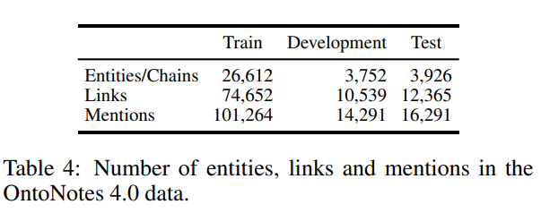
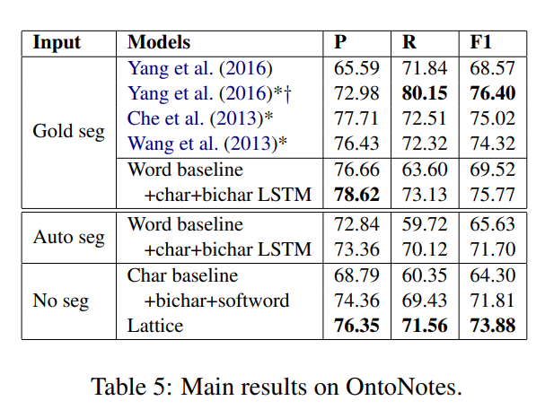
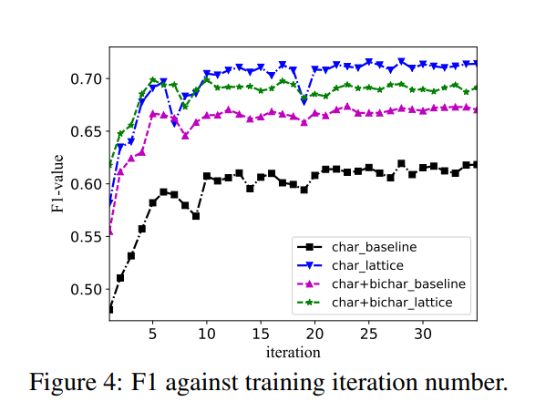

# All your need is Attention for bilingual NER mining

# Abstract
Named entity missing and recognition errors are top challenges for effective multilingual generation such as machine translation. The bilingual constraint that for each entity category the entity number should be equal, was employed to define SoftTag and SoftAlign for named entity recognition (NER) with success. We propose a Multilingual Bert with Tag and Align attention Net (META Net), by integrating SoftTag and SoftAlign attention layers, to learn bilingual constraints by decreasing cross-entropy losses for each NER category. Experiments including English-Chinese and English-German are performed on OntoNotes 5.0, ConLL2003 and WMT18 aligned corpora. All NER performances are better than state-of-the-art monolingual models, and Chinese and person entity recognition is significantly improved. Inspection of the results reveals some interesting discoveries such as capitalized person names in English and locations with common suffixes in Chinese are particularly helpful for NER in bitext. 

命名实体缺失和识别错误是机器翻译等多语言生成场景中的首要问题，分别占5.46％和4.38％[1]。每类实体的个数应该相等的双语约束,可以定义为SoftTag和SoftAlign， 通过Attention进行优化。我们提出了META 网络（Multilingual Bert with Tag and Align attention Net), 添加SoftTag和SoftAlign注意力层，通过减少逐类NER的交叉熵损失来学习双语约束。分别基于OntoNotes 5.0， ConLL2003和WMT18对齐语料库做了英汉和英德两组实验，所有NER性能均优于SOTA单语模型，而中文和人类别的提升最为明显，分别为3.3％，4.2％。通过人工分析确认，英文中的人名大写和中文的地名后缀等强特征能够很好的转移对其他语言，而学习噪声则主要因为双语语料大多来自文档级或章级对，而不是句子级对，有很多消岐和省略带来的错误.

- 1. Introduction
    - NER missing and recognition errors 是top问题 [MSRA ],
    - 微软AI团队，深入对比分析了MSR NMT系统与人类砖家翻译的区别。MSR NMT系统一直是WMT比赛的最优系统，在WMT 2019的17项比赛中，获得了9项第一。对比人类翻译专家的翻译，命名实体丢失和识别错误是机器翻译的Top问题，占比分别是5.46%和4.38%。双语命名实体识别优化，将是机器翻译系统提示的重要方向之一。
    - 命名实体识别的发展，经过从手工特征到深度学习特征到预训练模型阶段几个发展阶段。linear-chain conditional random fields (Lafferty et al., 2001) and semi-Markov conditional random fields (Sarawagi and Cohen, 2005),提供了基于线性链或半马尔科夫条件随机场或的方法，通过将转移概率和发射概率分别映射为图模型的边和点，最大似然估计计算模型参数，而模型的特征主要是前n字符到实体的序列化特征（边特征），当前字符到实体的概率（点特征），而模型预估，则是基于模型和输入序列，预测实体的开始，中间部分及非实体（BIO, B-实体开始，I-实体中间，O-非实体）。深度学习阶段，[NER ontonotes 1,2,3],特征的抽取不再手工指定前n字符，而是通过LSTM+CRF或者CNN、DGCNN+CRF来进行训练，其中LSTM，CNN，DGCNN来自动学习特征，通过CRF学习特征权重。预训练模型阶段，则是通过大量语料训练一个多层高参数的模型，在大算力和海量数据环境下，并且在多项任务上进行训练回归，取得最优结果。然后针对具体任务，如命名实体识别等，结合独立目标任务，在原有参数或模型最后一层做一定的微调fine-tuning，即可在较短时间和有限算力、少量数据情况下获得最佳效果。
    - 多语言命名实体识别，可以结合双语语料来继续优化命名实体识别效果。之前的有监督的命名实体识别，需要人工标注大量语料，而针对翻译等生成式任务，标注语料缺失更为严重。[Che]提出了一个双语命名实体优化办法，在两个单语标注语料的基础上，结合机器翻译的双语语料，实现标注优化。如”本“”伯南克“，直接进行中文命名实体识别，”本“不太可能识别为人名，而因为对齐语料”本“”伯南克“对齐到”Ben Bonanke“,因为”Ben Bonanke“是一个人名，因此”本 伯南克“也可以优化为人名。这篇文章将双语语料的Tag和Hard Align，优化为SoftTag和SoftAlign,标签和对齐都不只保留一个结果，而是给出一定概率，通过条件概率优化，实现标签和对齐的双重优化，最终把不同语言学习到的标注知识用到另一种语言，实现了命名实体识别的进一步提升。但是SoftTag和SoftAlign本身是基于统计的，有典型的三个问题。（1）词向量的语义表示是One-hot的，也就是词稍微不同，相似度相差很远，虽然后面用Cluster做了一定优化，但是效果有限；（2）SoftTag的计算还是基于词频统计的，在语料有限情况下，准确率不高；（3）SoftAlign基于MIT  Align生成，因为是基于词的硬对齐，没有语义学习能力，本身准确率不够，而soft化是通过双语来优化，而不是通过分布式语义优化，所以提升也有限。
    - Multilingual Bert, 已经被Google等证明特别是在序列标注类任务POSTAG和NER有效果。 [Google, Melboure], 多语言 BERT 是一个由 12 层 transformer 组成的预训练模型，它的训练语料包含了 104 种语言的维基百科页面，并且共享了一个词汇表。值得注意的是，多语言 BERT 在训练的时候既没有使用任何输入数据的语言标注，也没有使用任何翻译机制来来计算对应语言的表示。作者利用两个任务进行实验，实体命名识别（NER）和词性标注（POS），这两个任务都具有相似的特征，均可以使用序列标注的网络模型来进行。We then train a large model (12-layer to 24-layer Transformer) on a large corpus (Wikipedia + BookCorpus) for a long time (1M update steps), and that's BERT. 
    - 
  - 本文考虑构建一个统一的Bilingual 模型，来同时优化双语的NER识别。（1）基于Multilingual BERT的语义表示，能够很好支持跨语言的词向量编码表示，而且两个语言共用一个词向量表示，能够有效减少模型参数，避免过拟合。（2）SoftTag based Self-Attention , 两个单语约束，单语约束，主要是BIO编码中，第i个token为I-Entity, 第i-1个token必须是B-Entity或者I-Entity,或者B-Entity的token索引必须在[0,i-1]中。为了统一这种表示，我们考虑可以用两个指针数组进行实体标注，一个数组是标注实体的起始位置，如果是实体开始，则标注为1，否则标注为0；第二个数组是标注实体的结束位置，如果实体结束，则标注为1，否则标注为0；因此实体标注问题变成两个序列的二分类问题。因为是实现单语的标识，因此只需要一层Self-Attention +2个Dense数组即可。 （3）Cross-Attention based SoftAlign. 对于双语约束，源句和目标句的实体类别和实体数量应该相等，因此我们考虑逐类进行实体对齐，分别考虑Person, Location, Organization, 结合SoftTag生成的实体做对齐，并且增加和删除边缘token，进行finetuning优化。
  - 本文创新：（1）基于Multilingual BERT统一双语表示，为统一Tag和Align提供分布式语义表示基础；（2）基于M-Bert + Attention提供一个统一的SoftTag模型，而不是两个独立的Ner Tag模型，更全面学习两个语言的NER类型和数量一致的约束；（3）基于M-bert + Attention学习一个SoftAlign模型，而且我们只针对Entity做Align和微调，而不是传统的对齐模型对全部词做对齐，目标更明确，模型也更简单。
    - **问题**
        
    - **粗调问题**， tag识别错误， 地名 is located ....
    
    - **微调问题**，对齐，将 本 从”o“ -> "B-Per"
    

- 2.  相关研究

  ​      For the sequence labeling tasks, each label is not only related to the current input, but also has a correlation with the previous label. That is, the predicted labels in the sequence have strong dependence and follow specific pattern rules. For example, in the NER task with standard IOB2 labeling scheme [24], label “I-ORG” can follow “B-ORG” or other “I-ORG”, but “I-ORG I-PER” is not allowed. In this case, it is not appropriate to make independence assumption. Instead of independently labeling for each token, CRF [13] joint decodes the best label sequence for a sentence and has been widely adopted for sequence labeling tasks [14, 15, 16].

  ​      In recent years, with the rapid development of deep learning, some neural network based methods for sequence labeling problems have been proposed and made a great success. Collobert et al. [17] early used neural networks for sequence labeling, which is one of the most representative works. This paper proposed two network structures: window method and sentence method. The window method used the context window of the current predicted word as the input of the traditional linear network. The sentence method took the whole sentence as the input and added the relative position information to distinguish each word in the sentence. Then the CNN was used to process the word embedding sequence. For training, they also adopted two kinds of objective functions: one was the wordlevel log-likelihood, which used softmax to predict the label probability, and the
  other was the sentence-level log-likelihood, which added the label transition score to the objective function. Many later works refer to this idea as adding a CRF layer, which we call CNN-CRF here.

  ​      Since then, there are more nonlinear neural networks combined with CRF models emerging. Graves and Schmidhuber [18] first combined bidirectional LSTM (Bi-LSTM) [25] with CRF. This work used Bi- LSTM to model the word sequences in sentences and used CRF to jointly decode the label sequences, which used a large number of feature engineering and external gazetteers. Lample et al. [19] proposed an LSTM-CRF model for NER. In this model, skip-n-gram [26] was first used for pretraining of word embeddings, and then Bi-LSTM was used to capture character-level and word-level representation. An end-to-end sequence labeling model was proposed by Ma and Hovy [20]. Different from [19], this model used CNN to model character-level representation. Besides, there is no feature engineering or external lexicons used in it, but quite high performance is still achieved. These works mentioned can be categorized as LSTM-CRF type model. This kind of model is mainly composed of an embedding layer, LSTM layer, and CRF, in which the embedding layer contains the word vector, character vector as well as some external features. Compared with the previous CNN-CRF, the main difference is that the LSTM-CRF model uses LSTM instead of CNN, and experimental results show that LSTM-CRF achieves better performance[18, 19, 20].

  ​      Some other types of neural network models were proposed for sequential data modeling. Santos and Guimaraes [27] extended the CNN-CRF, which used “CharWNN” architecture [28] to extract character-level features. A bidirectional LSTM-CNNs model was proposed for NER [29], combining Bi-LSTM with “CharWNN” to mixed modeling of character-level and word-level features. Subsequently, Labeau et al. [30] proposed a similar model RNN-CNN for POS tagging,
  only using recurrent neural network (RNN) [31] instead of LSTM.

  ​    

-   3.  约束和算法

-  3.1 单语NER约束和SoftTag优化

  3.  1.1 BIO标注和CRF

      ​	NER是一个典型序列标注任务，给定一个句子，尝试给句子中每个词一个标签，标识其是否为实体。典型标注模式如BIO标注，对于实体类别T，BIO(Begin, Inside, Outside)的标注包括，B-T (Beging of Entity)表示实体开始，I-T(Inside of Entity)表示实体中间部分，而O表示非实体。

      ​        例如：

      $EN: The_O\ chairman_O\ of_O\ the_{B-ORG}\ Federal_{I-ORG}\ Reserve_{I-ORG}\ is_O\ Ben_{B-PER}\ Berna_{I-PER}\ \#\#\#nke_{I-PER}\ ._O$

      $ZH: 美_{B-ORG}\ 联_{I-ORG}\ 储_{I-ORG}\ 主_O\ 席_O\ 是_O\ 本_O\ 伯_{B-PER}\ 南_{I-PER}\ 克{I-PER}\ 。_O$

      

      最典型的序列标注算法是线性链条件随机场。假设随机变量序列X，输出目标序列$y_1, y_2,\dots,y_n$,建模的逻辑是希望目标序列概率最大，考虑马尔科夫性，即：

      $P（y_1, y_2, \dots, y_n | X)= P(y_1;x)P(y_1,y_2;x)P(y_2;x)P(y_2,y_3;x) \dots P(y_{n-1},y_n;x)P(y_n;x)$

      而考虑概率无向图的边特征和点特征，

      $$P_{CRF}(y|x) = \frac{1}{Z(x)}exp(\sum_{i,k}\lambda_kt_k(y_{i-1}, y_i,x,i)+\sum_{i,l}\mu_ls_l(y_i,x,i)) \\ =\frac{1}{Z(x)}exp(\sum_kf(y_{k-1},y_k;x)+\sum_lg(y_l;x))  $$

      其中:

      归一化因子 $Z(x)= \sum_yexp(\sum_{i,k}\lambda_kt_k(y_{i-1},y_i,x,i)+\sum_{i,l}\mu_ls_l(y_i,x,i)) = \sum_yexp(f(y_{i-1},y_i;x)+g(y_i;x))$

      $t_k, s_t$分别表示边和点的特征函数，而$\lambda_k,\mu_l$是对应的相关权重

      可以简化为，边特征$f(y_{i-1}, y_i;x) $和点特征$g(y_i;x)$

      -   where x and y are the input and output sequences, respectively, Z(x) is the partition function, and $M_i$ is the clique potential for edge clique i. Decoding in CRF involves finding the most likely output sequence that maximizes this objective, and is commonly done by the Viterbi algorithm. 
      -   and the objective function is: $max\sum_{i=1}^{|x|}\sum_{y\in{Y}}z_i^ylogP_i^y$ where Y is the set of all possible named entity tags. $Py_i = P(y_i = y|x) $ is the CRF probability that the $i_{th}$ word is tagged with y, and $z^y_i$ is an indicator that equals 1 iff the $i_{th}$ word is tagged y; otherwise, $z^y_i$ is 0.
          -   $\hat{y} = argmax_{y} P_{CRF}(y|x) = argmax_y\sum_ilogP(y_i|x)$
          -   模型的求解过程，即为求$\theta=(f,g)$的极大似然估计，通过EM算法进行求解

      $\hat\theta=argmax_{\theta}  log(P(Y|X))$

      对应的预测算法就是可以通过维特比算法，寻找概率最大的最优路径。

   3.1.2 单语NER约束和基于双Pointer的SoftTag

  ​       对于单语NER约束，主要有两条，每个词的所有标签类型之和为1，如果当前词标注为$I-T$,则上一词必然是$B-T或I-T$：

  (1)$\forall i \in n ,  \sum y^T_i=1, T是所有Tag的全集$

  (2)$\forall i, 0\lt i \le n, if\ y_i\in{I-T}, y_{i-1}\in \{I-T, B-T\}$

  $$\forall i, \forall T : y^{B-T}_{i-1} + y^{I-T}_{i-1} - y^{I-T}_{i} \geq 0                $$

  约束（2）可以转化成

  (3)$\forall i, 0\lt i \le n, if\ y_i\in{I-T}, \exist k , k \lt i , y_k \in B-T$

  约束（1）可以转化成一个逐帧softmax的分类问题，而约束（3）可以类似于双指针数组，通过一个$B-T$标志实体开始和一个$O$标注实体结束。

  

  基于双指针标注的SoftTag，考虑常见的NER类别$[PER_1, \ LOC_2, \ ORG_3 ]$,起始指针是一个三分类问题，而结束指针是一个2分类问题。

  $EN: The_0\ chairman_1\ of_2\ the_3\ Federal_4\ Reserve_5\ is_6\ Ben_7\ Berna_8\ \#\#\#nke_9\ ._{10}  $

  $SP(Start\ Pointer): [0_0\ 0_1\ 0_2\ 3_3\ 0_4\ 0_5\ 0_6\ 1_7\ 0_8\ 0_9\ 0_{10}]$

  $EP(End\ Pointer): [0_0\ 0_1\ 0_2\ 0_3\ 0_4\ 0_5\ 1_6\ 0_7\ 0_8\ 0_9\ 1_{10}]$

  在起始指针序列中，$3_{rd}$是3，最临近的不为0的结束指针为$6_{rd}$, 因此 sentence[3:6]是一个ORG实体，同理 sentence[7:10]是一个人名实体，即$\dots [the\ Federal\ Reserve]_{ORG}\ \dots [Ben\ Berna\ \#\#\#nke]_{PER}$ 

  

  3.1.3 Self Attention Score for SoftTag Similarity

  ​      An attention function can be described as mapping a query and a set of key-value pairs to an output,where the query, keys, values, and output are all vectors. The output is computed as a weighted sum of the values, where the weight assigned to each value is computed by a compatibility function of the query with the corresponding key.

  ​      A new attention layer on top of M-BERT layer is used to capture similar word attention at the sequence-level. In the attention layer, we introduce an attention matrix A to calculate the similarity between the current target word and all words in the sentence. The attention weight value at $j_{th}$ in the attention matrix is derived by comparing the $i_{th}$ current target word representation $x_i$ with the $j_{th}$ word  presentation $x_j$ in the sequence:
  $$
  softmax(\alpha_{i;j}) = \frac{exp(score(x_i, x_j))}{\sum_k(exp(score(x_i, x_k)))}
  $$
  

  ​      Here, the score is referred as an alignment function for which we define the following four alternatives (manhattan distance, euclildean distance, cosine distance and perceptron):
  $$
  score(x_i,x_j) = \begin{cases} W_a|x_i - x_j|, \\W_a(x_i - x_j)^T (x_i - x_j) , \\ W_a(x_i\cdot{x_j}) \\ tanh(W_a[x_i;x_j]) \end{cases}
  $$
  where the weight matrix $W_a$ is a parameter of the model, and • is the element-wise product. For the score of alignment function, the score values of cosine distance and perceptron are larger when the
  two vectors $x_i$ and $x_j$ are more similar. For simplicity, we choose cosine distance as our score function.

  

  3.2 双语NER约束和SoftAlign优化

- 本节分析双语NER约束，将双语约束设计为SoftAlign

  3.2.1 Bilingual Constraints

   For bilingual corpus, we assume that :

  (1) each entity alignment pair should have the same named entity tag.

  (2) each entity alignment pair should have aligned boundary. 

  For example, in Figure 1, the Chinese word “美联储” was aligned with the English words “the”, “Federal” and “Reserve”. Therefore, they have the same named entity tags ORG. Similarly, “本” and “Ben” as well as “伯南克” and “Bernanke” were all tagged with the tag PER. 

  

  Similar to monolingual constrained NER  (3.1), bilingual boundary constraints are added for each language as shown in Eqs. (8) and (9): 
$$
  \forall i\in{c} : \sum^{}y^T_i = 1; \forall j\in{e}: \sum^{} y^T_j=1   (8)\\

  \forall i, \forall T : y^{B-T}_{i-1} + y^{I-T}_{i-1} - y^{I-T}_{i} \geq 0                (9)\\

  \forall j, \forall T: y^{B-T}_{j-1} + y^{I-X}_{j-1} - y^{I-T}_{j}\geq 0
$$
  

  And Bilingual constraints can be described with two pointers:
$$
  \forall{(i,j)}\in{A}, \forall{X}: SP_i = SP_j, EP_i = EP_j(10)
$$
  where $A = {(i， j)}$ is the word alignment pair set, i.e., the $i_{th}$ English entity and the  $j_{th}$ Chinese word were aligned together, they have same Start Pointer value and End Pointer value.

  EN: The_0\ chairman_1\ of_2\ the_3\ Federal_4\ Reserve_5\ is_6\ Ben_7\ Berna_8\ \#\#\#nke_9\ ._{10}  

  $ZH: 美_0\ 联_1\ 储_2\ 主_3\ 席_4\ 是_5\ 本_6\ 伯_7\ 南_8\ 克_9\ 。_{10}  $

  $SP_{en}: [0_0\ 0_1\ 0_2\ 3_3\ 0_4\ 0_5\ 0_6\ 1_7\ 0_8\ 0_9\ 0_{10}]$

  $EP_{en}: [0_0\ 0_1\ 0_2\ 0_3\ 0_4\ 0_5\ 1_6\ 0_7\ 0_8\ 0_9\ 1_{10}]$

  $SP_{zh}: [3_0\ 0_1\ 0_2\ 3_3\ 0_4\ 0_5\ 0_6\ 0_7\ 1_8\ 0_9\ 0_{10}]$

  $EP_{zh}: [0_0\ 0_1\ 0_2\ 1_3\ 0_4\ 0_5\ 0_6\ 0_7\ 0_8\ 0_9\ 1_{10}]$

  $\dots[the\ Federal\ Reserve]_{ORG}\dots[Ben\ Berna\ \#\#\#nke]_{PER}$

  $\dots[美\ 联\ 储]_{ORG}\dots[伯\ 南\ 克]_{PER}$

  我们可以看出，虽然$[本\ 伯\ 南\ 克]_{PER}$没有被正确的识别为PER,但是因为对齐实体$[Ben\ Berna\ \#\#\#nke]_{PER}$被识别为PER，通过微调（移位）操作，我们很容易错误纠正过来。 

  3.  2.  2基于SoftTag 从HardAlign corpus到 SoftAlign corpus

      硬对齐是SMT中的最常见策略，包括FastAlign, Giza++, Berkerly Align等都能实现海量对齐语料下的词对齐。但是硬对齐是对所有词都尝试对齐，准确率不高。因为有强假设，双语语料中命名实体类别和个数是一致的，因此我们尝试只对命名实体做对齐和微调。

      为了保证数据质量，微调只考虑移位微调和纠偏微调。移位微调，如果$x[i:j]$是实体，我们考虑$x[i+1:j]， x[i-1:j],x[i:j+1],x[i:j-1]$也可能是实体，即$[伯\ 南\ 克\ ]_{PER}$是人名， $[本\ 伯\ 南\ 克]_{PER}$也可能是人名；纠偏微调，如果对齐实体的头部或者尾部相隔太远，则考虑将其头或尾对齐为相邻位置，即$[The\ Xinhua\ Agency]_{ORG}$,对齐从$[新\ 华\ 社]_{ORG}\dots[电]_{O}$,更改为$[新\ 华\ 社]_{ORG}$

      微调策略包括：

      （1）移位微调：

      ​			$if\ x[i:j]\in T, x[i-1:j]\in T\ (左移1位起始指针 )$

      ​		    $if\ x[i:j]\in T, x[i+1:j]\in T(右移1位起始指针)$

      ​            $if\ x[i:j]\in T, x[i:j+1]\in T(右移1位结束指针)$  

      ​            $if\ x[i:j]\in T, x[i:j+1]\in T(右移1位结束指针)$    

        （2）纠偏微调：

      ​             $\forall(i,j) \in HA, \begin{cases} x_e[i+1] = x_e[i], if\ (x_e[i+1] - x_e[i]) > (x_c[j+1] - x_c[j]) \\ x_c[j+1] = x_c[j], if \ (x_e[i+1] - x_e[i]) < x_c[j+1] - x_c[j]\\ no\ adjust, if\ (x_e[i+1] -x_e[i]) = (x_c[i+1] - x_c[i]) \end{cases} $

      ​              

      (简写HA为硬对齐，SA为软对齐)

      对于$\forall（i,j)\in HA$

      ~~~
    对于$\forall(i,j)\in A$
      ~~~

      

      3.2.3 Cross-Attention score for SoftAlign Similarity

      The new probabilistic model for bilingual NER is:
    $$
      P(y_e, y_c|x_e,x_c,SA) = \frac{P(y_e,y_c,x_e,x_c,SA) }{P(x_e,x_c,SA)} \\
    
      = \frac{P(y_c,x_c,x_e,SA)}{P(x_c,x_e,SA)} . \frac{P(y_e, x_c, x_e, SA)}{P(x_c, x_e, SA)} \\
    
         . \frac{P(y_c, y_e, x_c, x_e, SA).P(x_c, x_e, SA)}{P(y_c, x_c, x_e, SA) P(y_e, x_c, x_e, SA)} (11)\\
    
         \approx {P(y_c|x_c)P(y_e|x_e)} \frac{P(y_c, y_e | SA)}{P(y_c|A)P(y_e|SA)}  (12)
    $$
      where $y_e\ and\ y_c$ respectively denotes English and Chinese named entity, and SA is SoftAlign pairs which are fine tuned from HardAlign results. 

      The objective function for bilingual NER can be expressed as follows:
    $$
      max\sum^{|x_c|}_{i=1}\sum^{}_{t\in{T}}y^t_ilogP^t_i + \sum^{|x_e|}_{j=1}\sum^{}_{t\in{T}}y^t_jlogP^t_j
    $$
      where $P^t_i and P^t_j$ are the probabilities of the $i_{th}$ English word and $j_{th}$ Chinese word to be tagged with t, respectively. $x_e $ and $ x_c$ are respectively the English and Chinese sentences.

      And we just use Cross_Attentin score for SoftAlign Similarity, just like monolingual attenion function, we choose cosine similarity as our score function.
    $$
      softmax(\alpha_{i;j}) = \frac{exp(score(x_{ei}, x_{cj}))}{\sum_k(exp(score(x_{ei}, x_{ck})))}
    $$
  

  ​      

  ## Experiments

  We conduct experiments on the OntoNotes 4.0 corpus (LDC2011T03), which is one of the most famous bilingual corpus. The OntoNotes project has created a corpus of largescale, accurate, and integrated annotation of multiple levels of the shallow semantic structure in text. The idea is that this rich, integrated annotation covering many layers will allow for richer, cross-layer models enabling significantly better automatic semantic analysis. In addition to coreference, this data is also tagged with syntactic trees, high coverage verb and some noun propositions, partial verb and noun word senses, and 18 named entity types. However, such multi-layer annotations, with complex, cross-layer dependencies, demands a robust, efficient, scalable mechanism for storing them while providing efficient, convenient, integrated access to the the underlying structure. To this effect, it uses a relational database representation that captures both the inter- and intra-layer dependencies and also provides an object-oriented API for efficient, multitiered access to this data (Pradhan et al., 2007a). This should facilitate the creation of cross-layer features in integrated predictive models that will make use of these annotations. Although OntoNotes is a multi-lingual resource with all layers of annotation covering three languages: English, Chinese and Arabic, for the scope of this paper, we will just look at the English portion. Over the years of the development of this corpus, there were various priorities that came into play, and therefore not all the data in the English portion is annotated with all the different layers of annotation. There is a core portion, however, which is roughly 2 1.3M words which has been annotated with all the layers. It comprises ～450k words from newswire, ～150k from magazine articles, ～200k from broadcast news, ～200k from broadcast conversations and ～200k web data.

   We used the English-Chinese parallel corpus with named entity labels as our development and test data. And only choose 3 categories for Named Entity for our test, PER(person), Loc(location), ORG(organzation). Standard precision (P), recall (R) and F1-score (F1) are used as evaluation metrics.

   

  

  - *   SThe OntoNotes test results are shown in Table 5 8 . With gold-standard segmentation, our word-based methods give competitive results to the state-of-the-art on the dataset (Che et al., 2013; Wang et al., 2013), which leverage bilingual data. This demonstrates that LSTM-CRF is a competitive choice for word-based Chinese NER, as it is for other languages. In addition, the results show that our word-based models can serve as highly competitive baselines. With automatic segmentation, the F1-score of word+char+bichar LSTM decreases from 75.77% to 71.70%, showing the influence of segmentation to NER. Consistent with observations on the development set, adding lattice word information leads to an 88.81% → 93.18% increasement of F1-score over the character baseline, as compared with 88.81% → 91.87% by adding bichar+softword. The lattice model gives significantly the best F1-score on automatic segmentation.
*   
    

    
