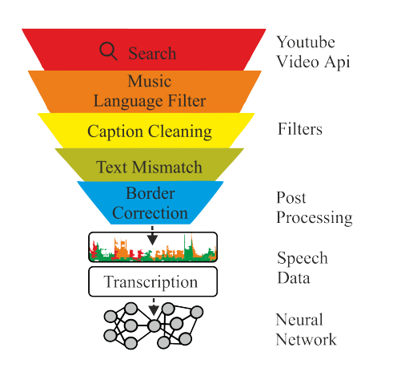
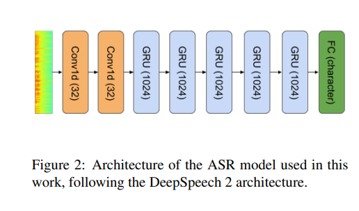
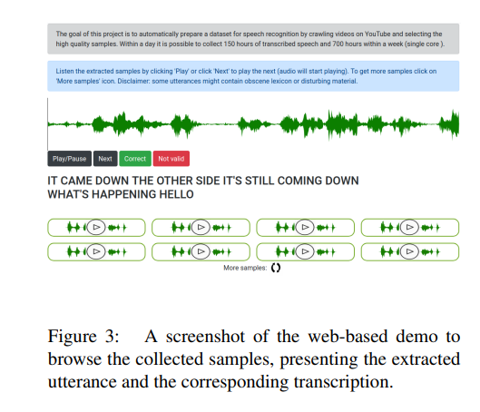
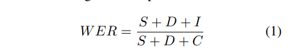

# KT-Speech-Crawler: Automatic Dataset Construction for Speech Recognition from YouTube Videos

## Egor Lakomkin, Hamburg, germany , 2018 emnlp, 

## 1 Abstract

-   In this paper, we describe KT-Speech-Crawler: an approach for automatic dataset construction for speech recognition by crawling YouTube videos. We outline several filtering and postprocessing steps, which extract samples that can be used for training end-to-end neural speech recognition systems. In our experiments, we demonstrate that a single-core version of the crawler can obtain around 150 hours of transcribed speech within a day, containing an estimated 3.5% word error rate in the transcriptions. Automatically collected samples contain reading and spontaneous speech recorded in various conditions including background noise and music, distant microphone recordings, and a variety of accents and reverberation. When training a deep neural network on speech recognition, we observed around 40% word error rate reduction on the Wall Street Journal dataset by integrating 200 hours of the collected samples into the training set. The demo1 and the crawler code2 are publicly available.
-   自动抓取youtube, 形成end-to-end corpus, training ASR
-   一天150hour, 3.5% WER
-   200h + wsj , WER 下降 40%

## 2 architect

-   

-   architect of proposed system crawling YouTube to find videos with closed captions. 

-   list corpus
    -    TED talks (Rousseau et al., 2014) are carefully transcribed and contain around 200 hours of
        speech from around 1,500 speakers (TED-LIUM
        v2 dataset). 
    -   LibriSpeech (Panayotov et al., 2015) is composed of a large number of audiobooks
        and is the largest freely available dataset: around
        960 hours of English read speech. 
    -   Google released their Speech Commands dataset6 containing around 65,000 one-second-long utterances.

## 3 Crawler

## 3.1 Candidate selection

## 3.2 Filtering steps

-   标题重复
-   我们过滤掉了这个示例中表示有音乐内容的标题和包含非ASCII字符或url的标题，
-   我们移除与实际口语文本不对应的文本块，例如说话人姓名（说话人1:…）、注释（[笑]、*笑*、（笑））和标点符号的信息，
-   我们拼出的数字在1到100之间，因为它们的发音没有歧义（相比之下，1500可以说成1500或1500））（fifteen hundred or one thousand and five hundred),3.3 post-processing steps）

-   如果标题中包含的字符不是英文字母、撇号或空格，我们将丢弃它们，
-   我们过滤持续时间小于1秒或大于10秒的片段？此外，我们从视频中随机选择三个短语，并测量提供的封闭字幕和Google ASR API生成的转录之间的Levenshtein相似度。
-   如果相似度低于70%的阈值，我们将丢弃此视频中的所有样本。此步骤允许对非英语口语文本或对齐错误的视频筛选具有英语字幕的视频。此外，此过滤器还会删除标题完全不对齐的视频。

## 3.3 Post-process

-   在我们对提取的样本进行质量评估的实验中，我们发现一个主要的问题是标题和音频之间的不精确对齐。例如，由于标题计时不正确，录制时可以省略第一个或最后一个单词。减少边界不对齐的样本数量的一种可能方法是，如果相邻标题的距离小于1秒，则将它们组合在一起。如果总长度超过10秒，我们就停止对相邻话语进行分组。此外，我们使用Kaldi（Povey et al.，2011）在标题和相应音频之间执行强制对齐9，如果第一个或最后一个单词未成功映射，我们尝试扩展标题边界（最长500毫秒），直到边界单词被映射。如果无法对齐边框词，则保持标题边框不变

## 4 Experiments

## 4.1 asr architect

## 4.2 Data & Evaluation

-   data
    -   wsj  284 speaker + 81 hours + 37,318 sentences
    -   ted talks 1495 speaker + 200 hours + 
-   demo
    -   
    -   
-   results
    -   WER 34.2% to 15.8% on the WSJ test set,  by adding 200 hours of samples (108,617 utterances) to the WSJ training set. 
    -   TED 
        -   wer 32.6% , 28.1%
        -   cer 10.4% 8.2%
        -   add 300 hours
    -   有趣的是，如果仅使用YouTube样本作为训练集，我们观察到WSJ和TED数据集的CER值分别为8.3%和10.6%（而使用原始训练数据的CER值分别为7.2%和10.4%），这表明拥有一个特定领域的训练集在设计更好的过滤和后处理步骤方面起着重要的作用，还有改进的余地。