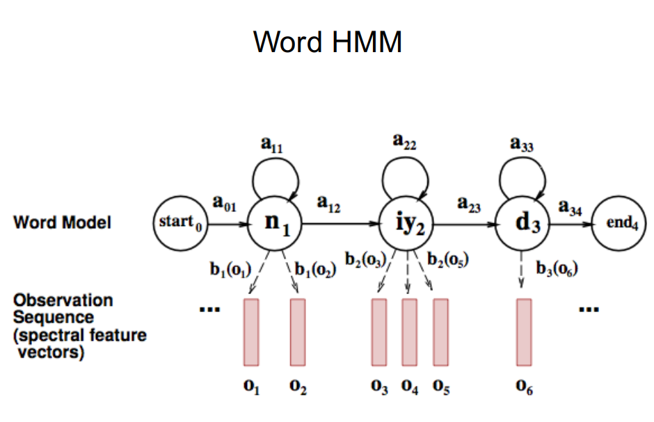

# Automatic Speech Recognition

-   http://aritter.github.io/courses/5525_slides/asr.pdf

-   https://www.zhuanzhi.ai/topic/2001474699686281/essence

-   [TOC]

    

## 1 Today SOTA

-   低资源
-   大词表（2-6万）
-   说话者无关/相关
-   连续说话/独立词
-   多语言、对话式
-   业界最好的系统
    -   人-人对话 ： 13-20% Word Error Rate(WER)
    -   人-机或者单人说话： 3-5% WER

-   

## 2 理论建模（Building an ASR System)

-   构建一个语音-文本的统计模型

    -   采集 语音 、 文本 语料
    -   训练有标签的语音模型

-   相关算法

    -   监督ML算法 + 搜索
    -   噪声信道模型

-   噪声信道模型

    -   $$
        \hat{W}=\underset{W\in L}{argmax}P(W|O) \\
        \hat{W}=\underset{W\in L}{argmax}\frac{P(O|W)P(W)}{P(O)} \\
        \hat{W}=\underset{W\in L}{argmax}P(O|W)P(W)
        $$

    -   $O : 输入序列（语音），\ W 可能的文本序列,\ \hat{W} 最优的文本序列$

    -   

    -   

## 3 ASR 系统组件

-   训练、测试语料
-   输入的格式和特征抽取
-   发声模型 （Pronunciation Model）
-   声学模型 （Acoustic Model）
-   语言模型（Language Model)
-   特征抽取组件
-   解空间的有效搜索算法

## 3.1 语料

-   small 语音-字符 （发声模型）
-   large (>=60 hours) 语音 - 文本（词、句）（Acoustic Model)
-   Very large 大文本语料建n-gram语言模型（Language Model)

## 3.2 声学模型

-   目标：构建文本生成模型
    -   输入：
        -   spectral features 谱特征
        -   发声模型（Pronuication Model)
        -   先验上（下）文（Prior context)
    -   输出：文本序列
-   模型：Hidden Markov Model(HMM)
    -   起始状态 （phones， subword units)
    -   转换概率（Transition probabilities) , 一个声音的下一个声音可能是什么？
    -   观测概率（Observation/output likelihoods), 
    -   
-   流程：
    -   初始化估计（initiate estimates)
        -   从语料或者展平开始（ phonetically transcribed corpus or flat start）
        -   转移概率(transition probabilities)：  phone states -> phone states
        -   观测概率： phone state->acoustic (spectral) feature
    -   嵌入式训练（embedded training） 
        -   重估变量
            -   initial phone HMMs + orthographically transcribed corpus + pronunciation lexicon 
            -   生成目标句
            -   迭代
    -   

## 3.3 发声模型

-   概率模型
    -   每个词多个发声
    -   用加权自动机或者词典计算 （weighted automaton or simple dictionary）
-   词从全语料获取
-   声音从发声词典或者TTS系统获取（ pronouncing dictionary or TTS system）
-   ASR Lexicon, 发声HMM模型

## 3.4 语言模型

-   给定前词，预估下词
-   Ngram model
-   Grammars
-   OOV(Out of vocabulary) problem

## 3.5 解码/搜索（Decoding/Search)

-   Find the best hypothesis $P(O|W)P(W)$
    -   acoustic feature vectors $(O)$
    -   trained HMM $(AM)$
    -   Lexicon $(PM)$
    -   Probabilities of word sequences $(LM)$
-   For O 
    -   find most likely state sequence
    -   N-best vs. 1-best vs. lattice output
-   Limiting Search
    -   Lattice minimization and determination
    -   Pruning: beam search

## 3.6 评估 （Evaluation, WER)

-   Transcript (字面上)
    -   $WER = (Subst + Ins + Del)/N * 100$
    -   
-   Understanding(语义上)
    -   概念识别正确性
        -   
-   

## 4 总结：

-   ASR today
    -   组合一堆概率
    -   近似“翻译”信号
-   ASR future
    -   更多语言特征模型