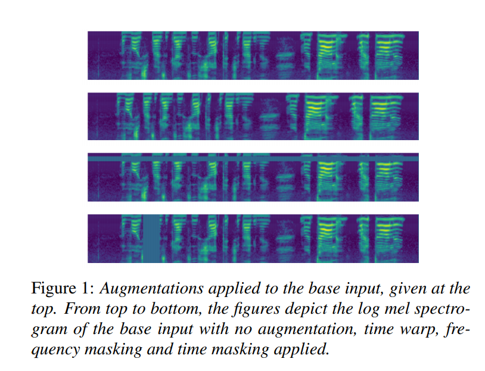
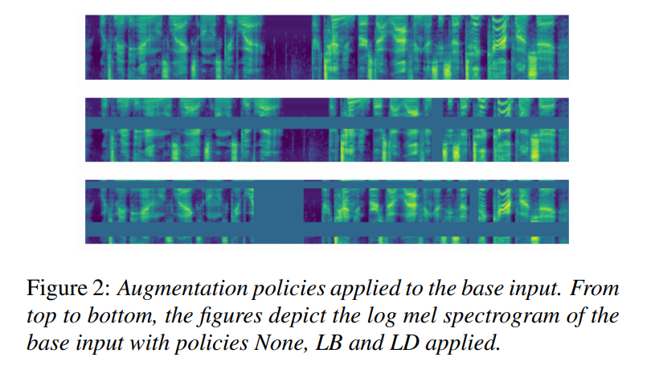
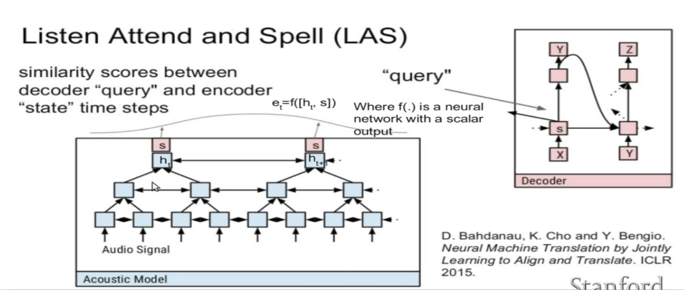
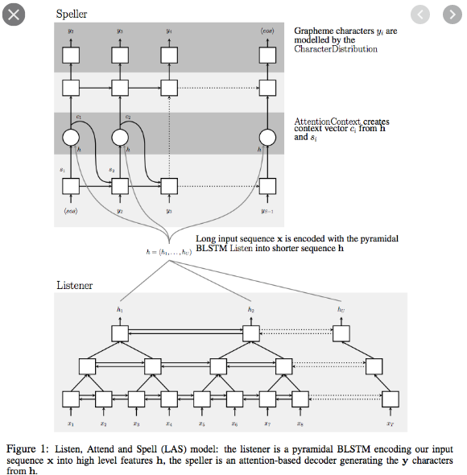
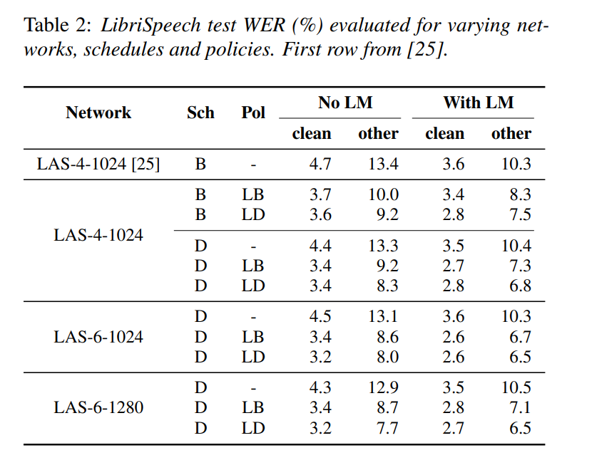
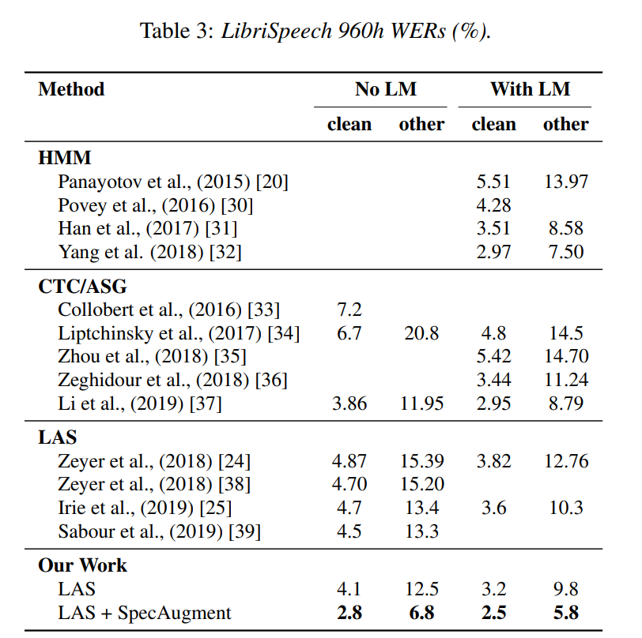
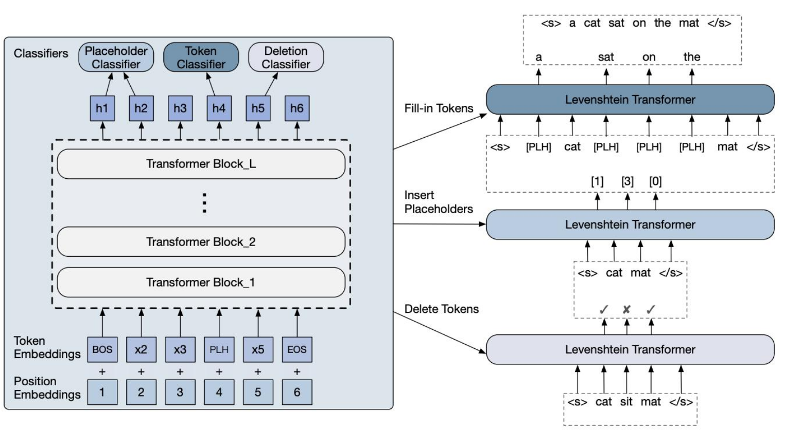

# 1 Specaugment: A simple
data augmentation method for automatic speech recognition

-   Daniel S Park,  Quoc V. Le, Google Brain, 2019

# 1.0 Abstract

-   SpecAugment on Listen, Attend and Spell networks for end-to-end speech recognition tasks

-   augment policy:
    -   warping the features
    -   masking blocks of frequency channels
    -   masking blocks of time steps
-   LibriSpeech WER : 
    -   6.  8%, + language model 5.8 %  
    -   sota: 7.5 %
-   Switchboard
    -   6.8 % 
    -   sota 8.3%

## 1.1 spec augment

## 1.3 model

### 1.3.1  LAS Network Architectures (Listen, Attend and Spell (LAS))

## 1.4 Experiment

# 2 Non-autoagressive transformer (Levestein Transformer)

# 3 next step

-   对Speech数据，加噪 ，通过讯飞、自研ASR，生成文本

-   对重复、语气词、标点统一模型

    -   insert delete transformer

    -   iterator transformer

        

# 

# 