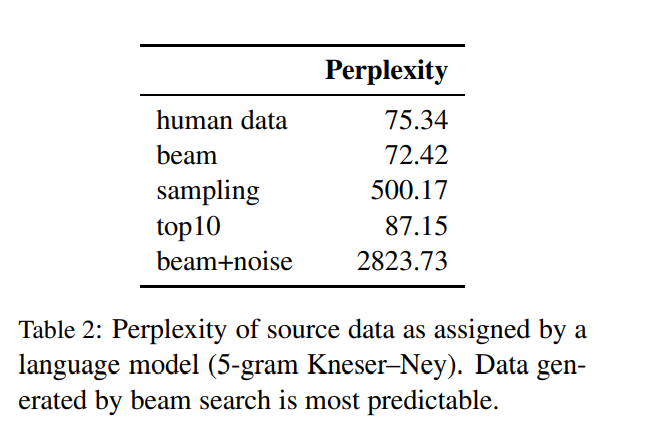

#  Understanding Back-Translation at Scale (Edunov et al., 2018)

https://github.com/pytorch/fairseq/tree/master/examples/backtranslation

## Abstract

An effective method to improve neural machine translation with monolingual data is to augment the parallel training corpus with back-translations of target language sentences. This work broadens the understanding of back-translation and investigates a number of methods to generate synthetic source sentences. We find that in all but resource poor settings back-translations obtained via sampling or noised beam outputs are most effective. Our analysis shows that sampling or noisy synthetic data gives a much stronger training signal than data generated by beam or greedy search. We also compare how synthetic data compares to genuine bitext and study various domain effects. Finally, we scale to hundreds of millions of monolingual sentences and achieve a new state of the art of 35 BLEU on the WMT’14 English-German test set.

-   back-translation via sampling or noised beam outputs
-   sampling/noisy synthetic data stronger than data generated by beam/greedy search
-   WMT14 En-De 35 BLEU (SOTA), En-Fr 45.6 BLEU

## 1 Introduction

-   Back-Translation: semi-supervised
    -   bi language
    -   mono language

## 2 Related Works

## 2.1 Neural Machine Translation

## 2.2 Semi-Supervised NMT

## 3 Generative synthetic sources

-    BT using Beam Search  (Sennrich et al., 2016a)
-   BT using greedy Search (Lample et al., 2018a,b) 
-   BT using Beam in finding high probability (Ott et al., 2018a).'
-   BT using noising, Lample et al. (2018a) 

## 4 Experiments

## 4.1 DataSets

## 4.2 Model and hyperparameters

## 5 Results

### 5.1 synthetic data generation methods

### 5.2 Analysis of generation methods

### 5.3 Low resource vs. high resource

### 5.4 Domain of synthetic data

-   add bitext (remaining parallel data)
-   add BT-bitext
-   add BT-news
-   

### 5.5 Upsampling the Bitext

### 5.6 Large scale results

