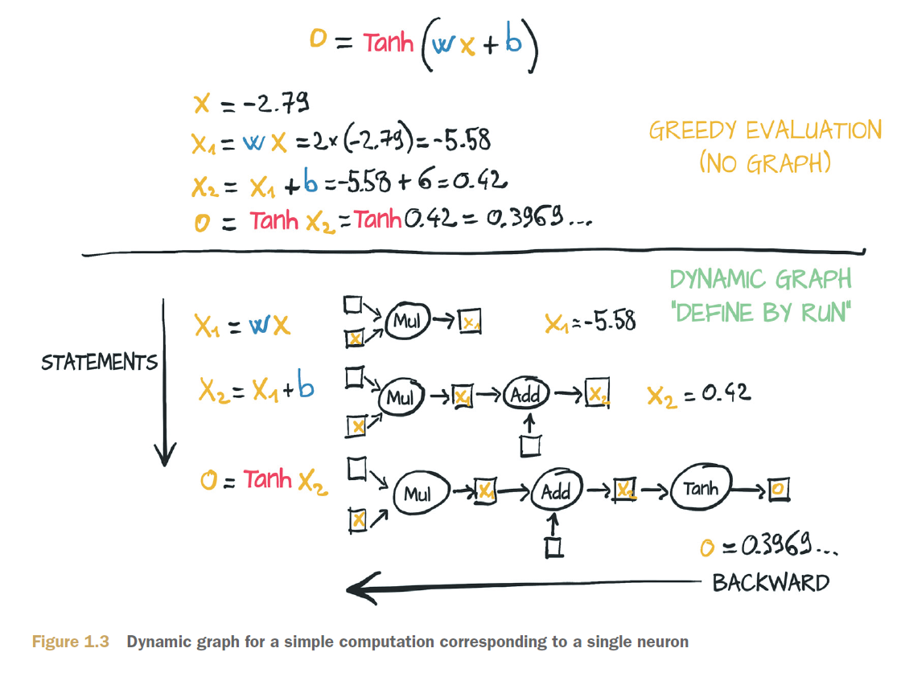
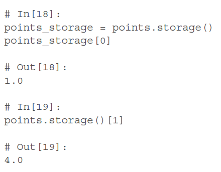

# Deep Learning with Pytorch

[TOC]

## 0 Code

https://github.com/yanghaocsg/dlwpt-code

## 1 Pytorch Introduction

## 2 Starts with a Tensor

-   size, storage offset, strides

    

-   2.4 Numberic Types

-   2.5 Indexing Tensors

    

-   2.6 Numpy Interoperability

-   2.7 Serializing tensors

-   2.8 moving to GPU

-   2.9 tensor API

-   Exercise

-   Summary

## 3 Real-word Data Presentation with Pytorch

-   3.3 Text

    

## 4 Mechanics of Learning

## 5 Neural Network to fit your Data

