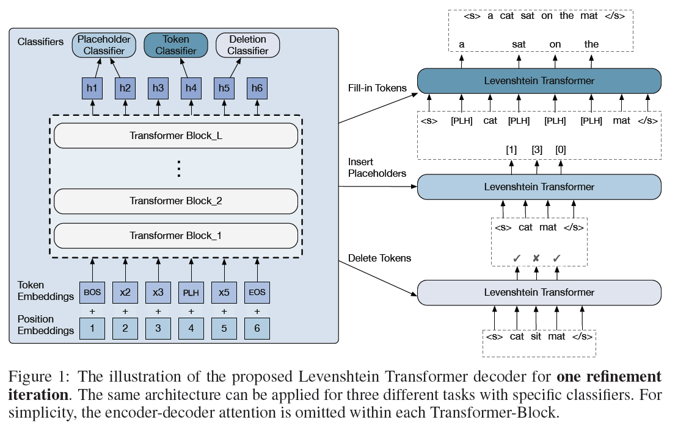
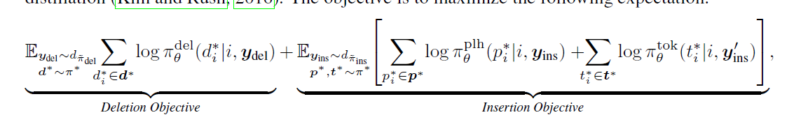
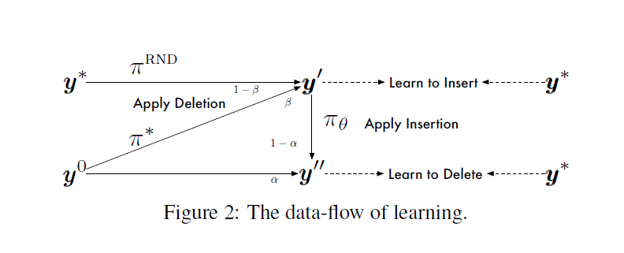
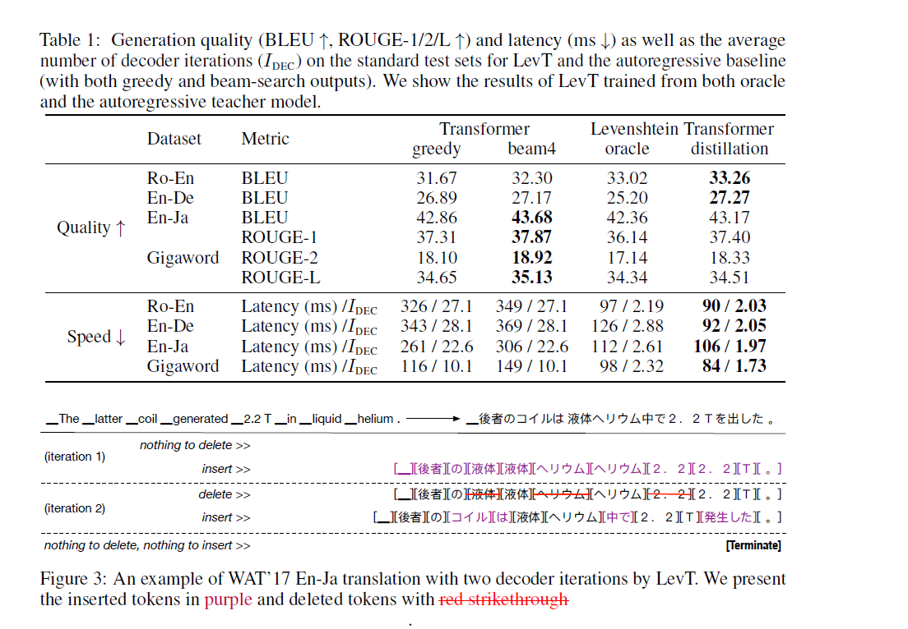
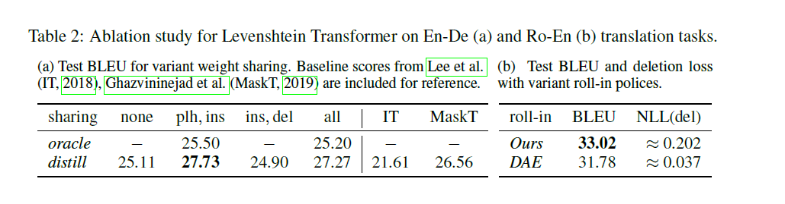
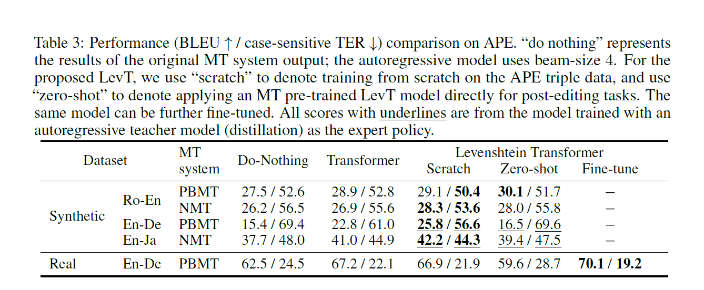
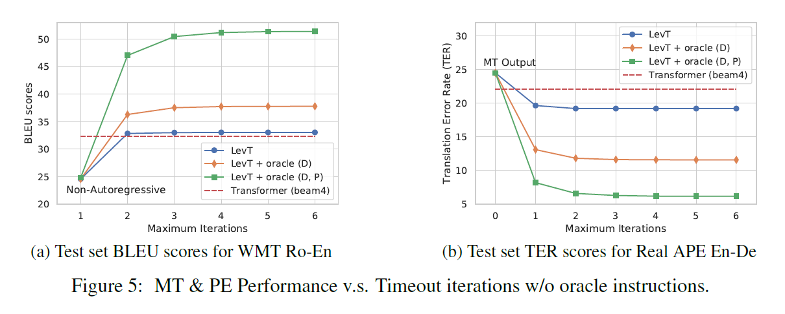

# Levenshtein Transformer

## Gu jiatao, FB, 2019

## 1 Abstract

-   Modern neural sequence generation models are built to either generate tokens step-by-step from scratch or (iteratively) modify a sequence of tokens bounded by a fixed length. In this work, we develop Levenshtein Transformer, a new partially autoregressive model devised for more flexible and amenable sequence generation. Unlike previous approaches, the basic operations of our model are insertion and deletion. The combination of them facilitates not only generation but also sequence refinement allowing dynamic length changes. We also propose a set of new training techniques dedicated at them, effectively exploiting one as the other’s learning signal thanks to their complementary nature. Experiments applying the proposed model achieve comparable or even better performance with much-improved efficiency on both generation (e.g. machine translation, text summarization) and refinement tasks (e.g. automatic post-editing). We further confirm the flexibility of our model by showing a Levenshtein Transformer trained by machine translation can straightforwardly be used for automatic post-editing. 
-   Levenshtein Transformer, Insertion/Deletion
-   training techniques not only generation but also sequence refinement allowing dynamic length changes
-   better performance both on machine translation, but also automatic post-editing

## 2 问题分析

## 2.1 Sequence Generation and Refinement

## 2.2 Actions: Deletion and Insertion

## 3 Levenshtein Transformer

## 3.1 model : Policy Classifier

-   Deletion Classifier
-   Placeholder classifier
-   Token classifier
-   weight sharing
-   early exit

## 3.2 Dual-policy Learning

-   Imitation Learning
-   
-   
-   Learn to insert
-   Expert policy

## 3.3 Inference

-   Greedy Decoding
-   Termination Condition
-   penalty for empty placeholders
-   

## 4 Experiments

## 4.1 sequence generation

## 4.2 Sequence Refinement

## 5 Related Works

## 5.1 Non-Autogressive and Non-Monotonic Decoding

## 5.2 Editing-based Models

