# NON-AUTOREGRESSIVE NEURAL MACHINE TRANSLATION

## Gu jiatao, FB, 2019

## 1 Abstract 

-   Existing approaches to neural machine translation condition each output word on previously generated outputs. We introduce a model that avoids this autoregressive property and produces its outputs in parallel, allowing an order of magnitude lower latency during inference. Through knowledge distillation, the use of input token fertilities as a latent variable, and policy gradient fine-tuning, we achieve this at a cost of as little as 2.0 BLEU points relative to the autoregressive Transformer network used as a teacher. We demonstrate substantial cumulative improvements associated with each of the three aspects of our training strategy, and validate our approach on IWSLT 2016 English–German and two WMT language pairs. By sampling fertilities in parallel at inference time, our non-autoregressive model achieves near-state-of-the-art performance of 29.8 BLEU on WMT 2016 English– Romanian.
-   non-autoregressive +knowledge distillation
-   并行解码，速度快；非自回归，质量好

## 2 Problem

## 2.1 Auto-regressive NMT

-   $X=\{x_1, ..., X_T\},\ Y=\{Y_1, ..., Y_T\} $
-   left-to-right casual structure:
    -   
    -   $special\ token\ y_0(eg.\ <bos>), y_{T+1}(eg.<eos>)$
-   Maximum Likelihood training : **Cross Entropy**
    -   
-   Autoregressive NMT without RNN : **Attention**
    -   Transformer

## 2.2 Non-autoregressive Decoding

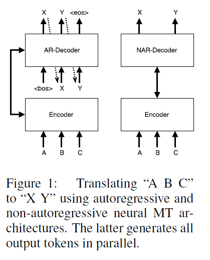

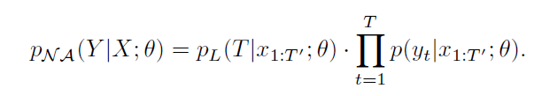

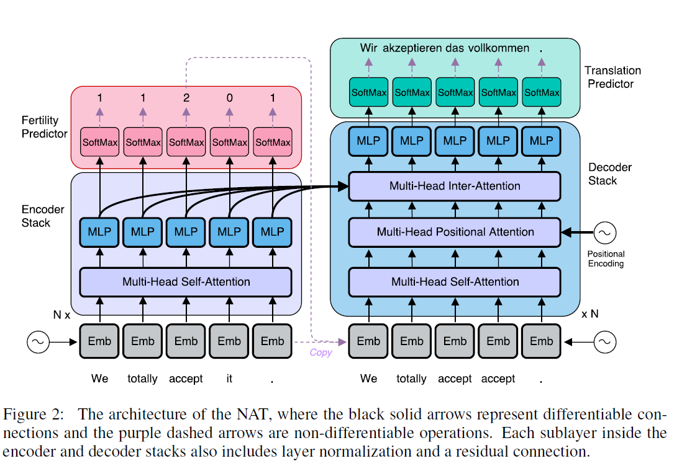

## 2.3 Multimodality Problem

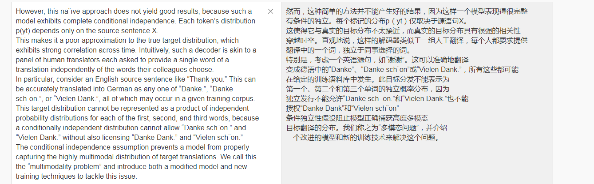

## 3 The Non-Autoregressive Transformer (NAT)

## 3.1 Encoder Stack

-   MLP + Multi-head Attention

## 3.2 Decoder Stack

-   Decoder Input
    -   copy source inputs uniformly
    -   copy source inputs using fertilities
-   Non-casual self-attention
-   Positional Attention
-   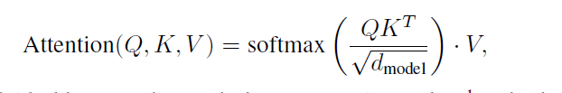

## 3.3 MODELING FERTILITY TO TACKLE THE MULTIMODALITY PROBLEM

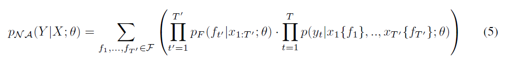

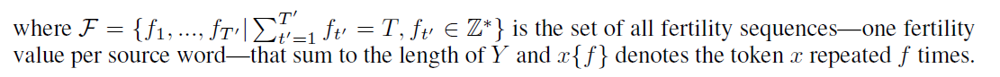

-   Fertility prediction
-   Benefits of fertility

## 3.4 TRANSLATION PREDICTOR AND THE DECODING PROCESS

-   argmax decoding
    -   
-   average decoding
    -   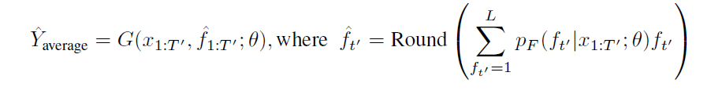
-   noisy parallel decoding(NPD)
    -   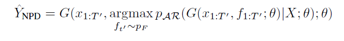

## 4 Training

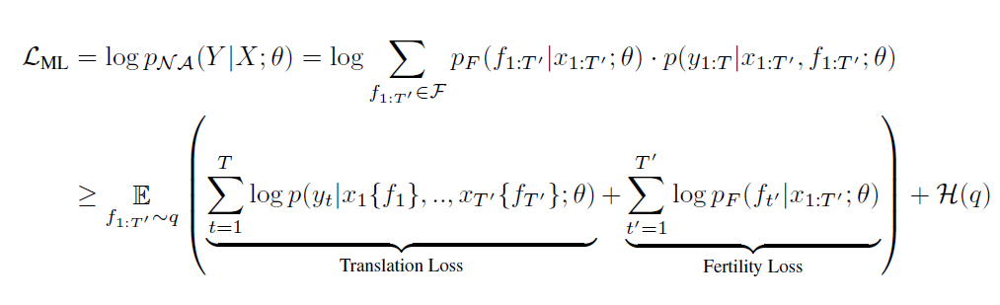

## 4.1  SEQUENCE-LEVEL KNOWLEDGE DISTILLATION

## 4.2 Fine-tuning

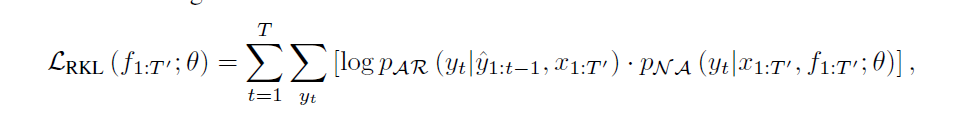

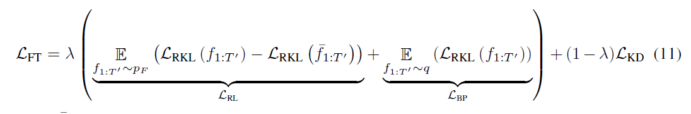

## 5 Experiments

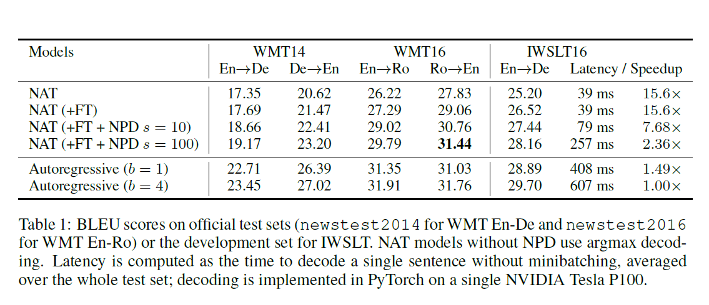

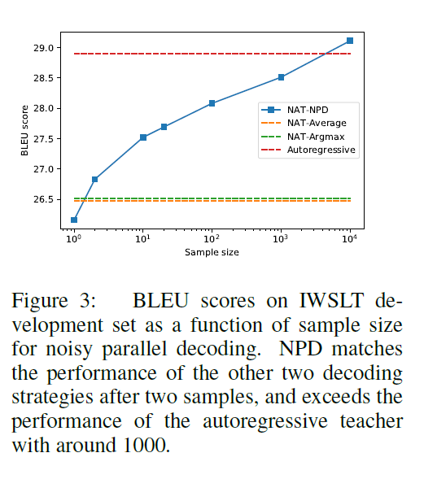

## 5.2 Results

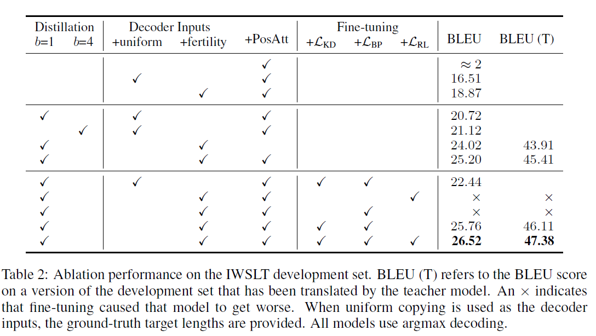

-   ablation
-   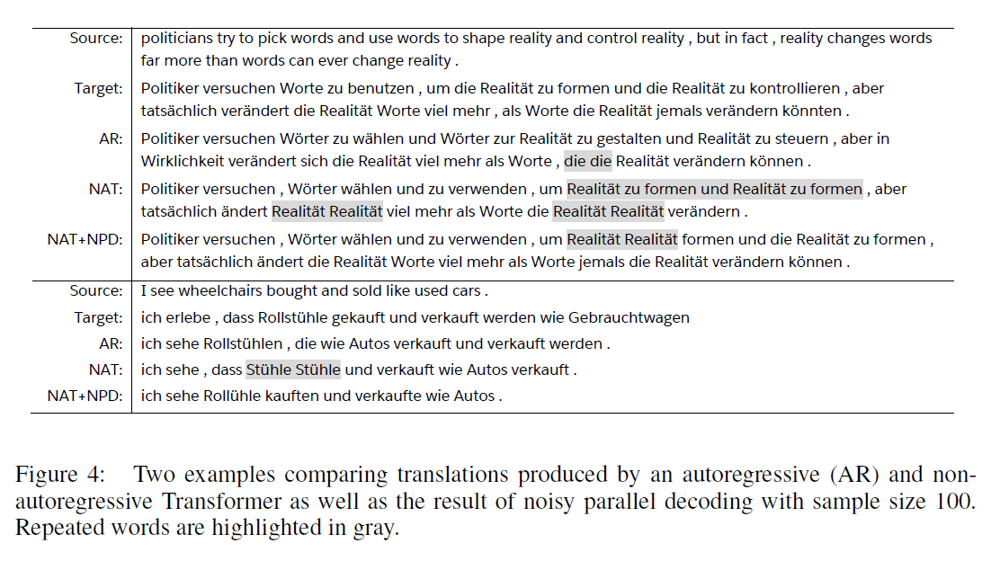
-   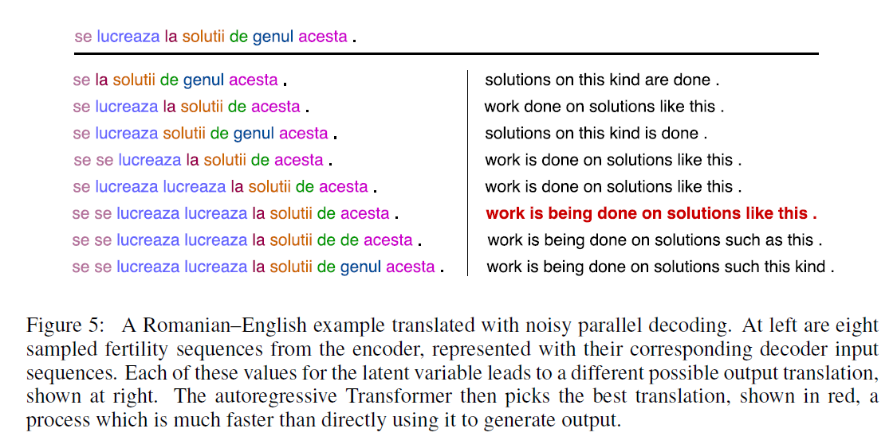

## 6 Analysis

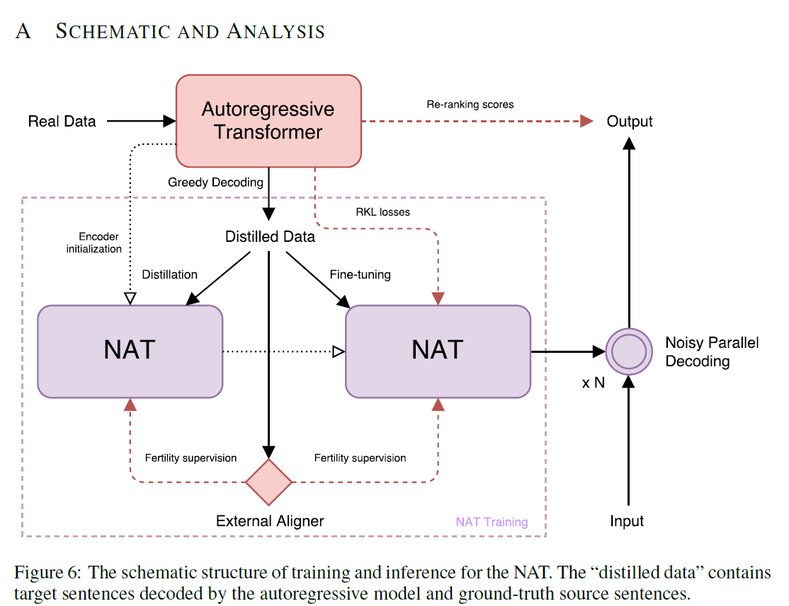

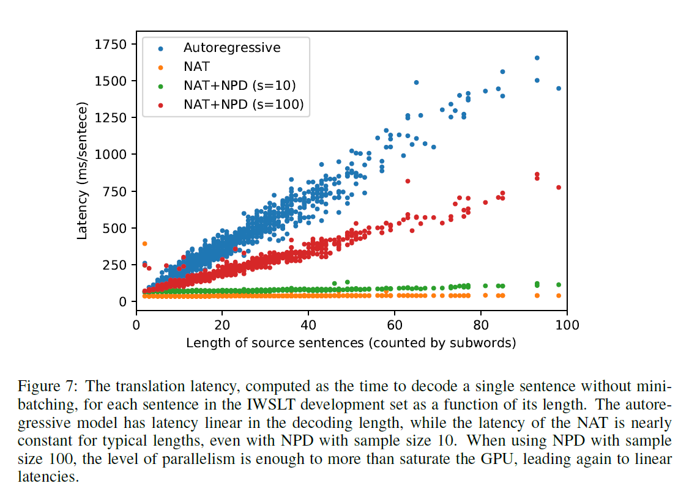

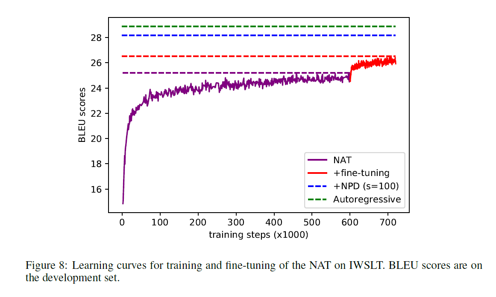

