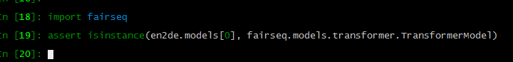
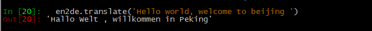
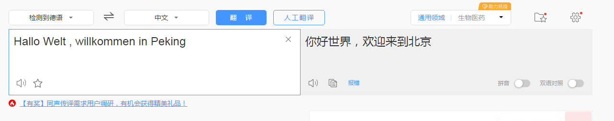
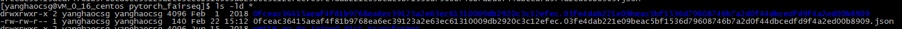
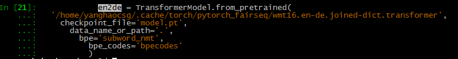
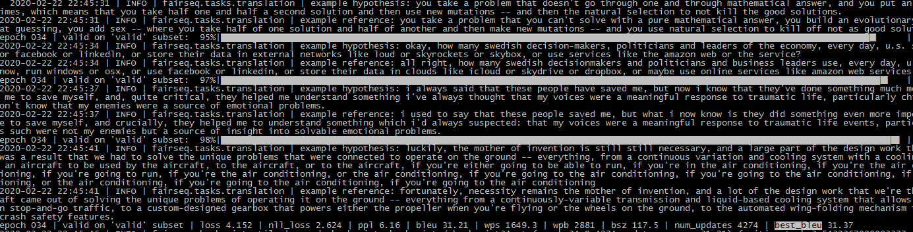

# Run Test for NA-NMT

## 1 Prepare data and torch.hub

## 1.1 torch hub 测试

-   hub加载模型（hub会下载到默认目录，有特殊编码方式）

-   ~~~
    pip install sacremoses subword_nmt
    
    import torch
    
    # List available models
    torch.hub.list('pytorch/fairseq')  # [..., 'transformer.wmt16.en-de', ... ]
    
    ## 如果出问题，可能是cython没有装，也可能是c++ < 5.0
    ## pip install cython
    ## scl enable devtoolset-4 bash
    ## gcc -version 
    ## gcc (GCC) 5.2.1 20150902
    
    
    ## 模型加载
    # Load a transformer trained on WMT'16 En-De
    en2de = torch.hub.load('pytorch/fairseq', 'transformer.wmt16.en-de', tokenizer='moses', bpe='subword_nmt')
    en2de.eval()  # disable dropout
    
    #Move model to GPU for faster translation
    en2de.cuda()
    
    # Translate a sentence
    en2de.translate('Hello world!')
    # 'Hallo Welt!'
    
    # Batched translation
    en2de.translate(['Hello world!', 'The cat sat on the mat.'])
    
    ~~~

-   

-   

-   

-   

-   2 自己下载或者训练，然后加载

    -   ~~~
        from fairseq.models.transformer import TransformerModel
        zh2en = TransformerModel.from_pretrained(
          '/path/to/checkpoints',
          checkpoint_file='checkpoint_best.pt',
          data_name_or_path='data-bin/wmt17_zh_en_full',
          bpe='subword_nmt',
          bpe_codes='data-bin/wmt17_zh_en_full/zh.code'
        )
        zh2en.translate('你好 世界')
        ~~~

    -   

## 2 准备数据

-    prepare-iwslt14.sh

## 3 训练

-   ~~~
    CUDA_VISIBLE_DEVICES=0 ~/.local/share/virtualenvs/research-UYzECQF4/bin/fairseq-train \
        data-bin/iwslt14.tokenized.de-en     --arch transformer_iwslt_de_en --share-decoder-input-output-embed \
            --optimizer adam --adam-betas '(0.9, 0.98)' --clip-norm 0.0   \
              --lr 5e-4 --lr-scheduler inverse_sqrt --warmup-updates 4000   \
                --dropout 0.3 --weight-decay 0.0001     --criterion label_smoothed_cross_entropy \
                --label-smoothing 0.1     --max-tokens 4096  --update-freq 8 --fp16 --tensorboard-logdir log_translation \
                --eval-bleu \
        --eval-bleu-args '{"beam": 5, "max_len_a": 1.2, "max_len_b": 10}' \
        --eval-bleu-detok moses \
        --eval-bleu-remove-bpe \
        --eval-bleu-print-samples \
        --best-checkpoint-metric bleu --maximize-best-checkpoint-metric
    ~~~

-    加速

    -   -- update-freq 8
    -   --fp16

-   验证

    -   --eval-bleu
    -   