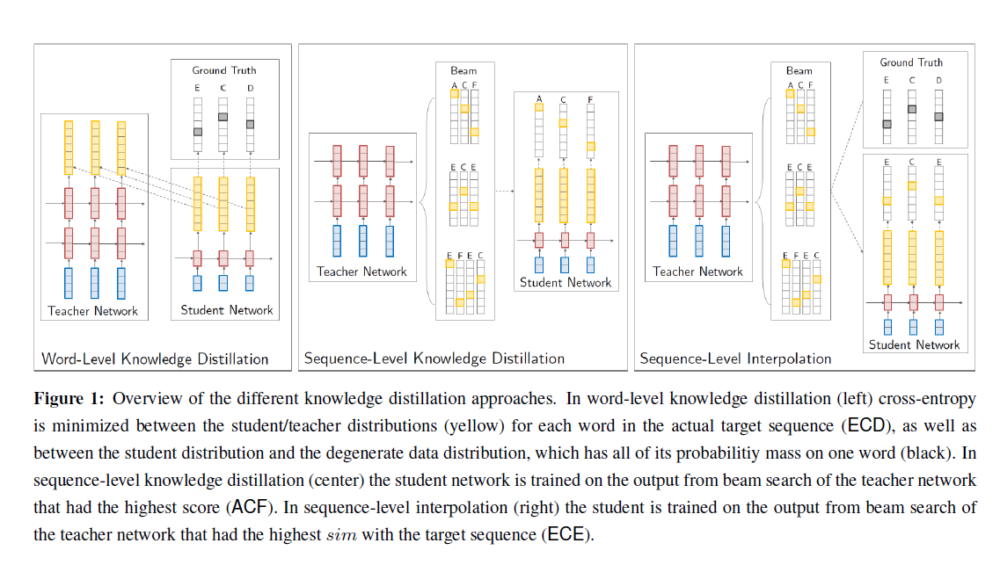
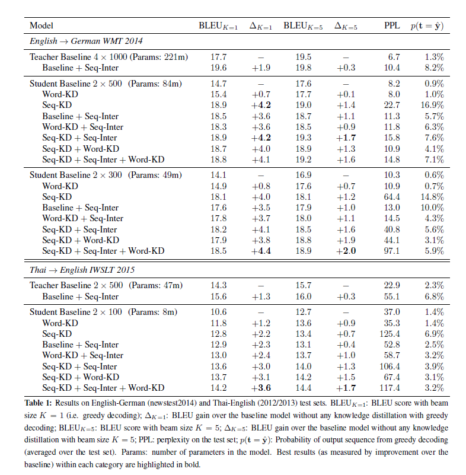

# Sequence Level Knowledge Distillation

## harvard university, 2016, Yoon Kim

## 1 Abstract 

Neural machine translation (NMT) offers a novel alternative formulation of translation that is potentially simpler than statistical approaches. However to reach competitive performance, NMT models need to be exceedingly large. In this paper we consider applying knowledge distillation approaches (Bucila et al., 2006; Hinton et al., 2015) that have proven successful for reducing the size of neural models in other domains to the problem of NMT. We demonstrate that standard knowledge distillation applied to word-level prediction can be effective for NMT, and also introduce two novel sequence-level versions of knowledge distillation that further improve performance, and somewhat surprisingly, seem to eliminate the need for beam search (even when applied on the original teacher model). Our best student model runs 10 times faster than its state-of-the-art teacher with little loss in performance. It is also significantly better than a baseline model trained without knowledge distillation: by 4:2=1:7 BLEU with greedy decoding/ beam search. Applying weight pruning on top of knowledge distillation results in a student model that has 13 fewer parameters than the original teacher model, with a decrease of 0:4 BLEU.

-   two novel seqence-level Knowledge Distillation

-   no need of beam search

-   run 10 times faster than SOTA teacher, 1/13 fewer parameter and - 0.4 BLEU

    

## 2 Background

-   sequence with attention
    -   $argmax_{t \in \tau}p(t|s)$
    -   seq-2-seq (Luong, 2015)
-   Knowledge Distillation
    -   $L_{NLL}(\theta)=-\sum^{|v|}_{k=1}1\{y=k\}logp(y=k|x;\theta)$
    -   $1\{. \} $ indicator function
    -   $p$ , distribution from our model, parameter by $\theta$
    -   $L_{KD}(\theta;\theta_T)= - \sum^{|V|}_{k=1}q(y=k|x;\theta_T)\mul logP(y=k|x;\theta)$
    -   $L(\theta;\theta_T)=(1-\alpha)L_{NLL}(\theta)+\alpha L_{KD}(\theta;\theta_T)$
    -   

## 3.1 Architure

## 3.2 Word Level KD

## 3.3 Sequence-Level KD

## 3.3 Sequence-Level Interpolation

## 4 Experiments

-   EN-DE WMT
-   EN-THAI IWSLT 2015

## 4.1 list pf experiments

-   Word KD
-   Seq KD
-   Seq Inter

## 5 Results

-   SOTA: Seq-KD + Seq-Inter +Word-KD
    -    the model was trained on Seq-KD data 
    -    finetuned towards Seq-Inter data with the mixture cross-entropy loss at the word-level.