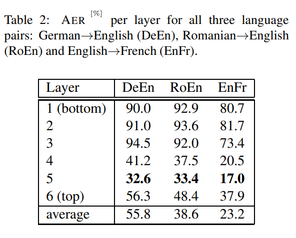

# Jointly Learning to Align and Translate with Transformer Models

[TOC]

## Abstract 

The state of the art in machine translation (MT) is governed by neural approaches, which typically provide superior translation accuracy over statistical approaches. However, on the closely related task of word alignment, traditional statistical word alignment models often remain the go-to solution. In this paper, we present an approach to train a Transformer model to produce both accurate translations and alignments. We extract discrete alignments from the attention probabilities learnt during regular neural machine translation model training and leverage them in a multi-task framework to optimize towards translation and alignment objectives. We demonstrate that our approach produces competitive results compared to GIZA++ trained IBM alignment models without sacrificing translation accuracy and outperforms previous attempts on Transformer model based word alignment. Finally, by incorporating IBM model alignments into our multi-task training, we report significantly better alignment accuracies compared to GIZA++ on three publicly available data sets. Our implementation has been open-sourced 1 .

-   从attention概率学习离散对齐
-   multi-task learning 同时学习对齐和翻译
-   基于transformer架构和融合IBM 对齐model
-   三个开源集合上，优于GIZA++

## 1 Introduction

-    多任务学习，
    -   NLL loss for NMT 
    -   one head attention for alignments
-   解决从左到右问题，即必须利用历史进行自回归的解码
    -   不同目标，不同部分上下文，解码
-   证明可以利用种子对齐，进行有监督解码
    -   利用NMT的attention概率
    -   或者基于SMT生成的对齐

## 2 Preliminaries

### Word Alignment Task

$A\sub\{(i,j):j=1,...,J;i=1,...,I\}$

### Transformer Model

$(Q,K,V)$

$H=Att(Q,K,V)$

$M=Concat(H_1,...,H_N)W^O$

with dot attention as below:

$Att = a^i_nVn, a^i_n=softmax(q^i_nK^T_n/\sqrt{d_k})$

## 3 Baseline method

-     from Attention to Align, $Att_{I，J} => Align(I,J)$
-    continuous to discrete
-   Peter(2017), zenkel(2019), Koehn 2015

## 4 Proposed method

### 4.1 Average Layer-wise Attention score

### 4.2 Multi-task Learning

$$
A_{I \times J} : Attention\ Matrix \\
G^P : Label\ Align\ Distribution \\
L_a(A) : Cross-entropy\ loss \\
L_t : standard\ NLL\ translation\ loss \\
L: Overall \ loss\ for\ MTL \\
L_a(A) = - \frac{1}{I} \sum^I_{i=1}\sum^J_{j=1}G^p_{i,j}log(A_{i,j}) \\
L = L_t + \lambda L_a(A) \\
$$

### 4.3 Providing Full Target Context

$$
L_t:\ auto-regressive\ to\ predict\ target\ token \\
two\ forward\ passes\ decoder,\\
(1)\ L_t\ masking future target\ \\
(2) \hat{L_a}: no\ masking for alignment loss \\
L_t = \frac{1}{I} \sum^I_{i=1}{log(p(e_i|f^J_1, e^{j-1}_1))} \\
\hat{L_a}(A) = L_a(A|f^J_1,e^I_1) \\
$$

### 4.4 Alignment Training Data

-   GIZA++

## 5 Experiments

### 5.1 Setup

-   BEP 32k
-   Alignment quality : Align Error Rate (AER),
-   AER significance : using two-sided Wilconxon signed-rank test($\alpha=0.1$)

### 5.1.1 Alignment Task

-   DeEn
-   RuEn
-   EnFr
-   

### 5.1.2 Align and Translate Task

### 5.2 Statistical Baseline

### 5.3 Averaging Attention Results

### 5.4 Alignment Task Result

### 5.5 Align and Translate Task Results

## 6 Analysis

