# 2GNN 的深度学习表示

-   Kipf, T.N.， 阿姆斯特丹大学， 2020

    [TOC]

    

# 0 publication (2 ICLR, 2 ICML, 1 NeurIPS)

-   https://dare.uva.nl/search?identifier=1b63b965-24c4-4bcd-aabb-b849056fa76d
-   

# 1 Introduction

## 1.1 structure and human cognition

-   graph
-   node
-   edge

## 1.2 artificial intelligence and deep learning

-   AI
-   DL
-   CNN

## 1.3 scope and research questions

-   Research Question 1:  解决下游任务，DNN for graph-structure datasets classifications
    -   Can we develop and efficiently implement deep neural networkbased models for large-scale node classification tasks in graph-structured datasets?
-   Research Question 2:  解决表示问题，GNN 连接预测和节点表示
    -   Can graph neural networks be utilized for link prediction and unsupervised node representation learning?
-   Research Question 3: 进行复杂推理
    -   Can deep neural networks infer hidden relations and interactions between entities, such as forces in physical systems?
-   Research Question 4: 结构化、时序数据推理提升
    -    How can we improve upon neural network-based models that infer event structure and latent program descriptions in sequential data?
-   Research Question 5:  DNN进行目标、关系和环境交互提升
    -   Can deep neural networks learn to discover and build effective representations of objects, their relations, and effects of actions by interacting with an environment?
-   任务 =》 表示 =》 推理 =》 时序 =》 环境交互

# 2 Background

## 2.1 相关符号

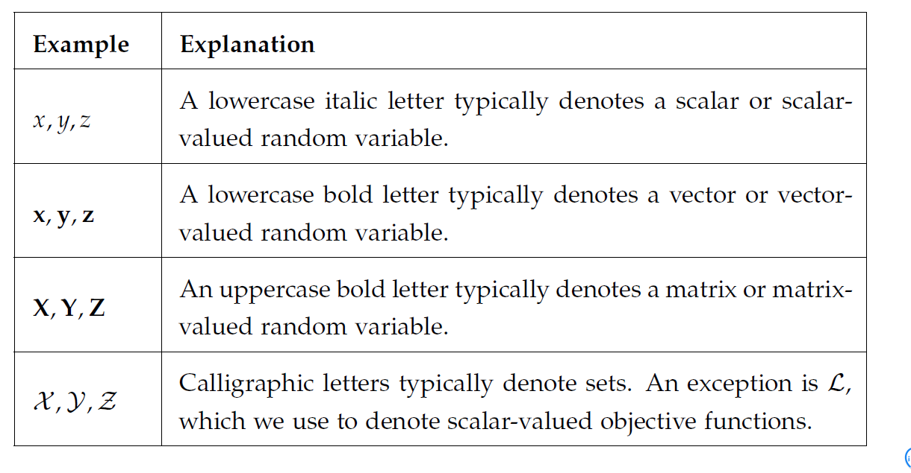

-   $ x, \bold{x},X,\mathcal{X}$ : 标量、向量、矩阵、集合

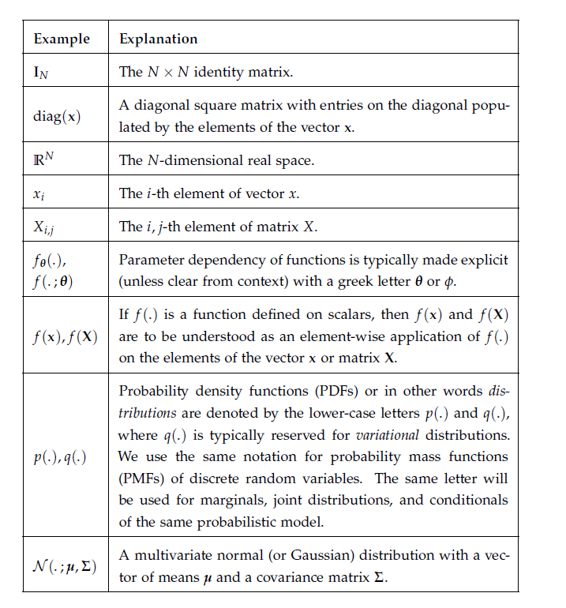

## 2.2 DNN

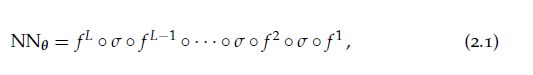

-   $f^L$ : 线性函数
-   $\sigma$ : 非线性函数
-   $\circ$ : 级联

-   $f^l = w_l*h + b_l$
-   $\circ = sigmoid(x)\ or \ relu(x)$

## 2.3 GNN

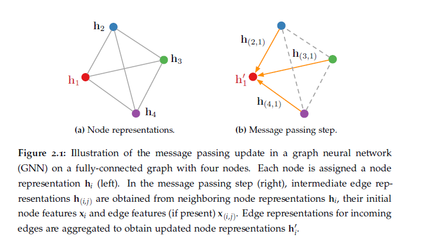

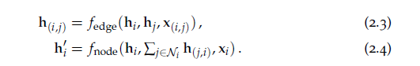

## 2.4 latent variable models (隐变量模型)

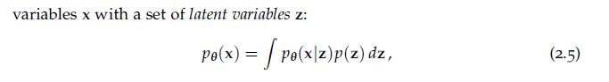

-   变量分布，变成基于一组隐变量的分布

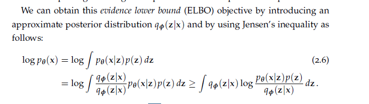

-   先验分布，变成后验分布
-   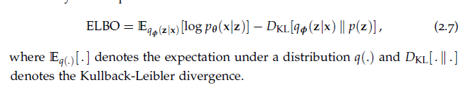
-   ELBO : Evidence lower bound
-   VAE:
-   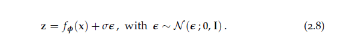

## 2.5 contrastive learning

-   noise contrastive estimation (NCE) 
-   negative sampling (Mikolov, 2013): 交叉熵，减少假阴性和假阳性
-   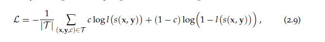
-   Hinge Loss： 同标签样本相似的高，不同标签，相似的样本低
-   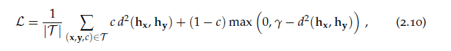
-   d: 经常用euclidean distance
-   

# 3 GCN 分类

# 4 GAE 预测关系（link)

# 5 GCN建模关系数据

# 6 GNN进行神经网络推理（Nerual Inference)

# 7 GNN有限的组合推理和学习

# 8 GNN逆向学习（Contrastive Learning)

# 9 Conclusion

