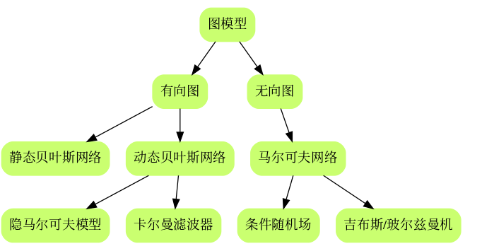

# ch 10  隐马尔可夫模型

## 前言

### 章节目录

1.  隐马尔可夫模型的基本概念
    1.  隐马尔可夫模型的定义
    2.  观测序列的生成过程
    3.  隐马尔可夫模型的三个基本问题
2.  概率计算方法
    1.  直接计算法
    2.  前向算法
    3.  后向算法
    4.  一些概率与期望值的计算
3.  学习算法
    1.  监督学习方法
    2.  Baum-Welch算法
    3.  Baum-Welch模型参数估计公式
4.  预测算法
    1.  近似算法
    2.  维特比算法


### 导读

-   我记得在[第六章](https://github.com/SmirkCao/Lihang/blob/master/CH06/README.md)有一个经典的文献介绍最大熵的原理的，例子是语言翻译。这章有个类似的文献就是书中给出的前两个参考文献[^4]， 书中的符号体系和书中的参考文献1的保持一致。
-   动态贝叶斯网络的最简单实现隐马尔可夫模型。HMM可以看成是一种推广的混合模型。
-   序列化建模，打破了数据独立同分布的假设。
-   有些关系需要理清



1.  隐马尔可夫模型、卡尔曼滤波器 都是 动态贝叶斯网络，也是有向图模型
2.  条件随机场，玻尔兹曼机，属于马尔可夫网络，也是无向图模型
3.  基本都是点特征 + 边特征，进行模型拟合

-   另外一个图

```
graph TD
	subgraph 贝叶斯网络
	A1((A))-->B1((B))
	A1-->C1((C))
	B1-->D1((D))
	C1-->D1
	end
	
	subgraph 马尔可夫网络
	A2((A))---B2((B))
	A2---C2((C))
	B2---D2((D))
	C2---D2
	end
```

另外，注意一点，在李老师这本书上介绍的HMM，涉及到举例子的，给的都是观测概率矩阵是离散的情况，对应了Multinominal HMM。但这个观测概率矩阵是可以为连续的分布的，比如高斯模型，对应了Gaussian HMM，高斯无处不在。具体可以参考hmmlearn库^2

-   HMM有两个基本假设和三个基本问题， 两个基本假设。$I$是隐变量。
-   才发现这一章居然都没有提到概率图模型。