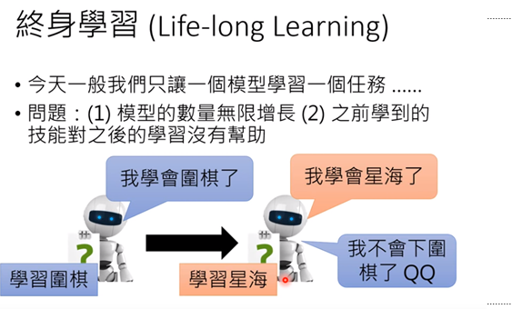

# 机器学习的下一步

# The Next Step for Machine Learning

From: 李宏毅（lihongyi)

https://www.youtube.com/watch?v=XnyM3-xtxHs

[TOC]

## Outline

## Anomaly Detection , 什么时候说不知道

## Explainable AI

## 防止 Adversarial Attack

## Life-Long Learning

## Learn-to-Learn

## 一定要很多训练数据吗?

## 增强学习一定有用吗？

## 神经网络压缩

## 训练和预测同分布？

