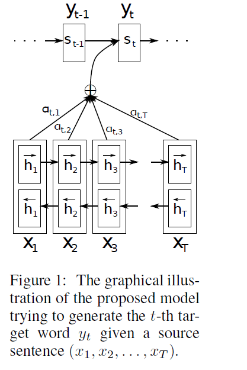
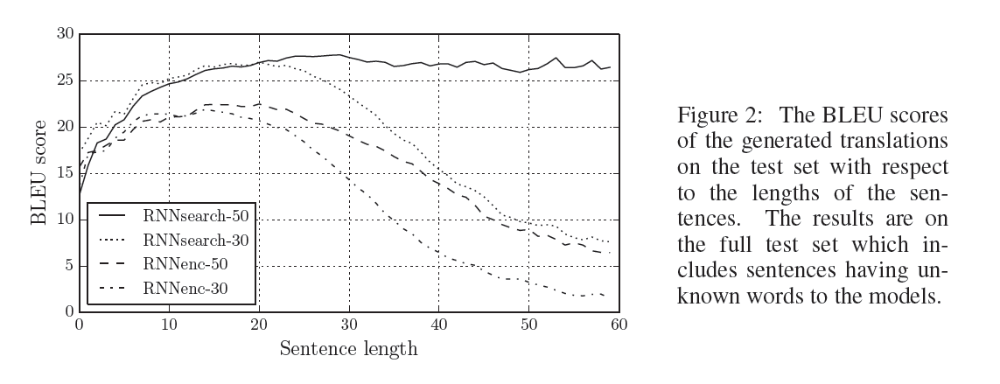
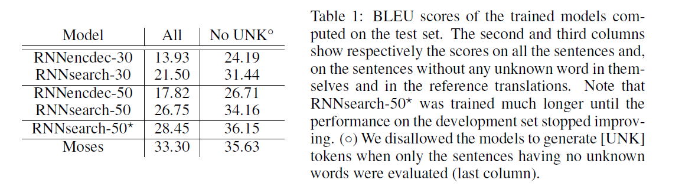
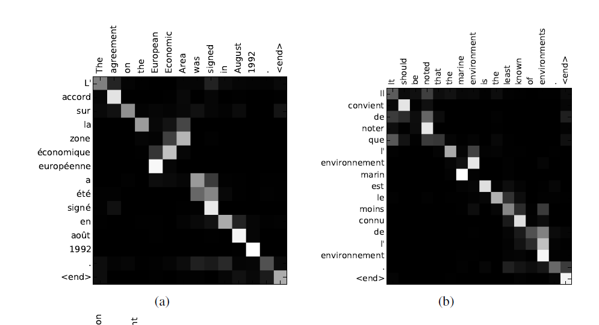
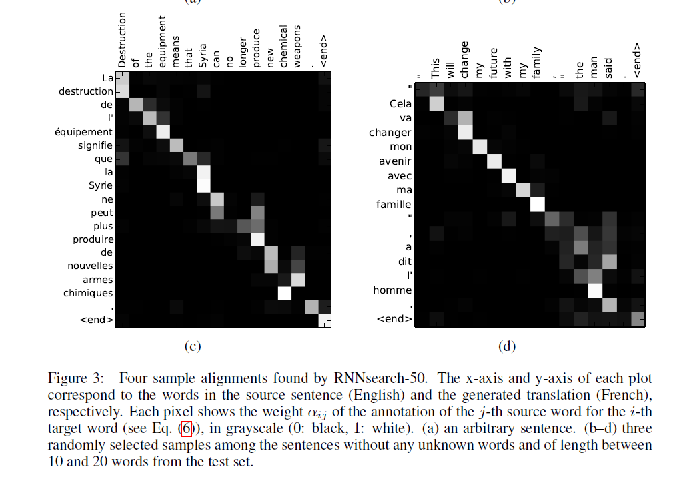

# NEURAL MACHINE TRANSLATION BY JOINTLY LEARNING TO ALIGN AND TRANSLATE

Dzmitry Bahdanau, Yoshua Bengio

## 前言

Neural machine translation is a recently proposed approach to machine translation. Unlike the traditional statistical machine translation, the neural machine translation aims at building a single neural network that can be jointly tuned to maximize the translation performance. The models proposed recently for neural machine translation often belong to a family of encoder–decoders and encode a source sentence into a fixed-length vector from which a decoder generates a translation. In this paper, we conjecture that the use of a fixed-length vector is a bottleneck in improving the performance of this basic encoder–decoder architecture,and propose to extend this by allowing a model to automatically (soft-)search for parts of a source sentence that are relevant to predicting a target word, without having to form these parts as a hard segment explicitly. With this new approach,we achieve a translation performance comparable to the existing state-of-the-art phrase-based system on the task of English-to-French translation. Furthermore,qualitative analysis reveals that the (soft-)alignments found by the model agree well with our intuition.

神经机器翻译是最近提出的机器翻译方法。与传统的统计机器翻译不同，神经机器翻译旨在构建单个神经网络，可以联合调整以最大化翻译性能。最近提出的用于神经机器翻译的模型通常属于编码器 - 解码器系列，并且将源语句编码成固定长度的矢量，解码器从该矢量生成翻译。在本文中，我们推测固定长度向量的使用在提高这种基本编码器 - 解码器架构的性能方面是一个瓶颈，并建议通过允许模型自动（软）搜索源句子的部分来扩展它。这与预测目标词有关，而不是明确地将这些部分形成为硬段。通过这种新方法，我们实现了与英语到法语翻译任务的现有基于艺术家的现有系统相当的翻译性能。此外，定性分析表明，模型发现的（软）对齐符合我们的直觉。

# INTRODUCTION 

Neural machine translation is a newly emerging approach to machine translation, recently proposed by Kalchbrenner and Blunsom (2013), Sutskever et al. (2014) and Cho et al. (2014b). Unlike the traditional phrase-based translation system (see, e.g., Koehn et al., 2003) which consists of many small sub-components that are tuned separately, neural machine translation attempts to build and train a single, large neural network that reads a sentence and outputs a correct translation. 

Most of the proposed neural machine translation models belong to a family of encoder– decoders (Sutskever et al., 2014; Cho et al., 2014a), with an encoder and a decoder for each language, or involve a language-specific encoder applied to each sentence whose outputs are then compared (Hermann and Blunsom, 2014). An encoder neural network reads and encodes a source sentence into a fixed-length vector. A decoder then outputs a translation from the encoded vector. The whole encoder–decoder system, which consists of the encoder and the decoder for a language pair, is jointly trained to maximize the probability of a correct translation given a source sentence. 

A potential issue with this encoder–decoder approach is that a neural network needs to be able to compress all the necessary information of a source sentence into a fixed-length vector. This may make it difficult for the neural network to cope with long sentences, especially those that are longer than the sentences in the training corpus. Cho et al. (2014b) showed that indeed the performance of a basic encoder–decoder deteriorates rapidly as the length of an input sentence increases. 

In order to address this issue, we introduce an extension to the encoder–decoder model which learns to align and translate jointly. Each time the proposed model generates a word in a translation, it (soft-)searches for a set of positions in a source sentence where the most relevant information is concentrated. The model then predicts a target word based on the context vectors associated with these source positions and all the previous generated target words

The most important distinguishing feature of this approach from the basic encoder–decoder is that it does not attempt to encode a whole input sentence into a single fixed-length vector. Instead, it encodes the input sentence into a sequence of vectors and chooses a subset of these vectors adaptively while decoding the translation. This frees a neural translation model from having to squash all the information of a source sentence, regardless of its length, into a fixed-length vector. We show this allows a model to cope better with long sentences.

 In this paper, we show that the proposed approach of jointly learning to align and translate achieves significantly improved translation performance over the basic encoder–decoder approach. The improvement is more apparent with longer sentences, but can be observed with sentences of any length. On the task of English-to-French translation, the proposed approach achieves, with a single model, a translation performance comparable, or close, to the conventional phrase-based system. Furthermore, qualitative analysis reveals that the proposed model finds a linguistically plausible (soft-)alignment between a source sentence and the corresponding target sentence.

引言神经机器翻译是一种新兴的机器翻译方法，最近由Kalchbrenner和Blunsom（2013），Sutskever等人提出。 （2014年）和Cho等人。 （2014B）。与传统的基于短语的翻译系统（参见，例如，Koehn等人，2003）不同，神经机器翻译试图建立和训练一个单独的大型神经网络句子并输出正确的翻译。

大多数提出的神经机器翻译模型属于编码器解码器系列（Sutskever等人，2014; Cho等人，2014a），每种语言都有编码器和解码器，或者涉及应用语言特定的编码器然后比较其输出的每个句子（Hermann和Blunsom，2014）。编码器神经网络将源句子读取并编码为固定长度的矢量。然后，解码器从编码矢量输出平移。整个编码器 - 解码器系统，包括用于语言对的编码器和解码器，被联合训练以最大化给定源句子的正确翻译的概率。

这种编码器 - 解码器方法的潜在问题是神经网络需要能够将源句子的所有必要信息压缩成固定长度的矢量。这可能使神经网络难以处理长句，特别是那些比训练语料库中的句子长的句子。 Cho等人。 （2014b）表明，随着输入句子的长度增加，基本编码器 - 解码器的性能确实恶化。

为了解决这个问题，我们引入了编码器 - 解码器模型的扩展，该模型学习了共同对齐和翻译。每次所提出的模型在翻译中生成单词时，它（软）搜索源语句中的一组位置，其中最相关的信息被集中。然后，模型基于与这些源位置和所有先前生成的目标词相关联的上下文向量来预测目标词

这种方法与基本编码器 - 解码器最重要的区别特征是它不会尝试将整个输入句子编码成单个固定长度的矢量。相反，它将输入句子编码成矢量序列，并在解码翻译时自适应地选择这些矢量的子集。这使得神经翻译模型不必将源句的所有信息（无论其长度）压缩成固定长度的矢量。我们证明这允许模型更好地应对长句。

 在本文中，我们表明，与基本编码器 - 解码器方法相比，所提出的联合学习对齐和转换的方法实现了显着改进的转换性能。使用较长的句子可以更明显地改善，但可以用任何长度的句子观察。在英语到法语翻译的任务中，所提出的方法利用单个模型实现了与传统的基于短语的系统相当或接近的翻译性能。此外，定性分析表明，所提出的模型在源句和相应的目标句之间找到了语言上可信的（软）对齐。

# 2 BACKGROUND: 

NEURAL MACHINE TRANSLATION From a probabilistic perspective, translation is equivalent to finding a target sentence y that maximizes the conditional probability of y given a source sentence x, i.e., $argmax( p(y|x))$. In neural machine translation, we fit a parameterized model to maximize the conditional probability of sentence pairs using a parallel training corpus. Once the conditional distribution is learned by a translation model, given a source sentence a corresponding translation can be generated by searching for the sentence that maximizes the conditional probability.

  Recently, a number of papers have proposed the use of neural networks to directly learn this conditional distribution (see, e.g., Kalchbrenner and Blunsom, 2013; Cho et al., 2014a; Sutskever et al., 2014; Cho et al., 2014b; Forcada and N? eco, 1997). This neural machine translation approach typically consists of two components, the first of which encodes a source sentence x and the second decodes to a target sentence y. For instance, two recurrent neural networks (RNN) were used by (Cho et al., 2014a) and (Sutskever et al., 2014) to encode a variable-length source sentence into a fixed-length vector and to decode the vector into a variable-length target sentence. 

  Despite being a quite new approach, neural machine translation has already shown promising results. Sutskever et al. (2014) reported that the neural machine translation based on RNNs with long shortterm memory (LSTM) units achieves close to the state-of-the-art performance of the conventional phrase-based machine translation system on an English-to-French translation task.1 Adding neural components to existing translation systems, for instance, to score the phrase pairs in the phrase table (Cho et al., 2014a) or to re-rank candidate translations (Sutskever et al., 2014), has allowed to surpass the previous state-of-the-art performance level.

神经机器翻译从概率的角度来看，翻译相当于找到一个目标句子y，它使给定源句x的y的条件概率最大化，即$arg max(p(y | x))$。在神经机器翻译中，我们拟合参数化模型以使用并行训练语料库最大化句子对的条件概率。一旦通过翻译模型学习条件分布，给定源句子，可以通过搜索使条件概率最大化的句子来生成相应的翻译。

  最近，许多论文提出使用神经网络直接学习这种条件分布（参见，例如，Kalchbrenner和Blunsom，2013; Cho等，2014a; Sutskever等，2014; Cho等，2014b） ; Forcada和N？eco，1997）。这种神经机器翻译方法通常由两个部分组成，第一个编码源句x，第二个解码为目标句y。例如，（Cho等人，2014a）和（Sutskever等人，2014）使用两个递归神经网络（RNN）将可变长度源句子编码成固定长度的矢量并将该矢量解码为一个可变长度的目标句子。

  尽管是一种非常新的方法，神经机器翻译已经显示出有希望的结果。 Sutskever等人。 （2014）报道，基于具有长短期记忆（LSTM）单元的RNN的神经机器翻译在英语 - 法语翻译任务上达到了接近传统的基于短语的机器翻译系统的最新性能。 .1将神经组件添加到现有翻译系统，例如，对短语表中的短语对进行评分（Cho等，2014a）或重新排名候选翻译（Sutskever等，2014），已经超越以前最先进的性能水平。

## 2.1 RNN ENCODER–DECODER 

Here, we describe briefly the underlying framework, called RNN Encoder–Decoder, proposed by Cho et al. (2014a) and Sutskever et al. (2014) upon which we build a novel architecture that learns to align and translate simultaneously. 

In the Encoder–Decoder framework, an encoder reads the input sentence, a sequence of vectors $x = (x_1; \dots; x_{T_x} )$, into a vector $c$ . The most common approach is to use an RNN such that

 $$h_t = f (x_t; h_{t-1} (1) $$

and $c = q ({h_1; \dots ; h_{T_x}})$  where $h_t\in R^n$ is a hidden state at time t, and c is a vector generated from the sequence of the hidden states. f and q are some nonlinear functions. Sutskever et al. (2014) used an LSTM as f and $q ({h_1;\dots;  h_{T}}) = h_T$ , for instance.

The decoder is often trained to predict the next word $y_{t^`}$ given the context vector $c$ and all the previously predicted words ${y_1; \dots ; y_{t^`-1}}$. In other words, the decoder defines a probability over the translation y by decomposing the joint probability into the ordered conditionals: 

$$p(y) = \prod^T_{t=1}(y_t|{y_1, \dots, y_{t-1}},c); (2)$$ 

where $y = (y_1;\dots;y_{T_y})$. With an RNN, each conditional probability is modeled as 

$$p(y_t|{y_1; \dots;y_{t-1}}, c) = g(y_{t-1},s_t, c); (3)$$

 where g is a nonlinear, potentially multi-layered, function that outputs the probability of yt, and st is the hidden state of the RNN. It should be noted that other architectures such as a hybrid of an RNN and a de-convolutional neural network can be used (Kalchbrenner and Blunsom, 2013).

$$ h_t = f（x_t; h_ {t-1}（1）$$

和$ c = q（{h_1; \ dots; h_ {T_x}}）$其中$ h_t \ in R ^ n $是时间t的隐藏状态，c是从隐藏状态序列生成的向量。 f和q是一些非线性函数。 Sutskever等人。 （2014）使用LSTM作为f和$ q（{h_1; \dots; h_ {T}}）= h_T $。

给定上下文向量$ c $和所有先前预测的单词$ {y_1,\dots, y_{T-1}}$训练解码器预测下一个单词$ y_ {t ^`} $。换句话说，解码器通过将联合概率分解为有序条件来定义翻译y的概率：

$$ p（y）= \prod ^ T_ {t = 1}（y_t | {y_1，\dots，y_{t-1}}，c）; （2）$$

其中$ y =（y_1; \dots; y_{T_y}）$。使用RNN，每个条件概率被建模为

$$ p（y_t | {y_1; \dots; y_{t-1}}，c）= g（y_{t-1}，s_t，c）; （3）$$

 其中g是非线性的，可能是多层的函数，它输出yt的概率，st是RNN的隐藏状态。应当注意，可以使用诸如RNN和去卷积神经网络的混合的其他架构（Kalchbrenner和Blunsom，2013）。

# 3 LEARNING TO ALIGN AND TRANSLATE 

In this section, we propose a novel architecture for neural machine translation. The new architecture consists of a bidirectional RNN as an encoder (Sec. 3.2) and a decoder that emulates searching through a source sentence during decoding a translation (Sec. 3.1). 

## 3.1 DECODER: GENERAL DESCRIPTION

In a new model architecture, we define each conditional probability in Eq. (2) as: 
$$p(y_i|y1,\dots, y_{i-1}, x) = g(y_{i-1}, s_i,  c_i); (4) $$
where $s_i$ is an RNN hidden state for time i, computed by $s_i = f(s_i, \dots,c_i)$

 It should be noted that unlike the existing encoder–decoder approach (see Eq. (2)), here the probability is conditioned on a distinct context vector $c_i$ for each target word $y_i$. 

 The context vector $c_i$ depends on a sequence of annotations $(h_1;\dots;h_{T_x} )$ to which an encoder maps the input sentence. Each annotation hi contains information about the whole input sequence with a strong focus on the parts surrounding the i-th word of the input sequence. We explain in detail how the annotations are computed in the next section. 

 The context vector $c_i$ is, then, computed as a weighted sum of these annotations$h_i$:

 $$c_i = \sum^{T_x}_{j=1} \alpha_{ij}h_j  (5)$$

 The weight $\alpha_{ij}$ of each annotation $h_j$ is computed by 

$$\alpha_{ij} = \frac{exp (e_{ij})}{\sum^{T_x}_{k=1}exp(e_{ik}) ;} (6) $$

where $e_{ij} = \alpha(s_{i-1}, h_j)$ is an alignment model which scores how well the inputs around position j and the output at position i match. The score is based on the RNN hidden state $s_{i-1}$ (just before emitting $y_i$, Eq. (4)) and the j-th annotation $h_j$ of the input sentence. 

 We parametrize the alignment model a as a feedforward neural network which is jointly trained with all the other components of the proposed system. Note that unlike in traditional machine translation,the alignment is not considered to be a latent variable. Instead, the alignment model directly computes a soft alignment, which allows the gradient of the cost function to be backpropagated through. This gradient can be used to train the alignment model as well as the whole translation model jointly. 

We can understand the approach of taking a weighted sum of all the annotations as computing an expected annotation, where the expectation is over possible alignments. Let $\alpha_{ij}$ be a probability that the target word yi is aligned to, or translated from, a source word $x_j$ . Then, the i-th context vector ci is the expected annotation over all the annotations with probabilities $\alpha_{ij}$ . 

The probability $\alpha_{ij}$ , or its associated energy $e_{ij}$ , reflects the importance of the annotation hj with respect to the previous hidden state $s_{i-1}$ in deciding the next state si and generating yi. Intuitively, this implements a mechanism of attention in the decoder. The decoder decides parts of the source sentence to pay attention to. By letting the decoder have an attention mechanism, we relieve the encoder from the burden of having to encode all information in the source sentence into a fixed length vector. With this new approach the information can be spread throughout the sequence of annotations, which can be selectively retrieved by the decoder accordingly.

在新的模型体系结构中，我们在Eq中定义每个条件概率。 （2）如：
$$ p（y_i | y1，\dots，y_ {i-1}，x）= g（y_{i-1}，s_i，c_i）; （4）$$
其中$ s_i $是时间i的RNN隐藏状态，由$ s_i = f（s_i，\dots，c_i）$计算

 应当注意，与现有的编码器 - 解码器方法不同（参见方程（2）），这里概率以每个目标字$ y_i $的不同上下文向量$ c_i $为条件。

 上下文向量$ c_i $取决于编码器映射输入句子的注释序列$（h_1; \dots; h_ {T_x}）$。每个注释hi包含关于整个输入序列的信息，其强烈关注于围绕输入序列的第i个字的部分。我们将在下一节详细解释如何计算注释。

 然后，上下文向量$ c_i $被计算为这些注释$ h_i $的加权和：

 $$ c_i = \ sum ^ {T_x} _ {j = 1} \alpha_ {ij} h_j（5）$$

 每个注释$ h_j $的权重$ \ alpha_ {ij} $由...计算

$$ \alpha_ {ij} = \frac {exp（e_ {ij}）} {\sum^{T_x}_{k = 1} exp（e_ {ik}）;}（6）$$

其中$ e_ {ij} = \ alpha（s_ {i-1}，h_j）$是一个对齐模型，用于评估位置j周围的输入和位置i的输出匹配的程度。得分基于RNN隐藏状态$ s_ {i-1} $（恰好在发出$ y_i $，Eq。（4）之前）和输入句子的第j个注释$ h_j $。

 我们将对齐模型a参数化为前馈神经网络，该网络与所提出的系统的所有其他组件共同训练。请注意，与传统的机器翻译不同，对齐不被视为潜在变量。相反，对齐模型直接计算软对齐，这允许成本函数的梯度反向传播。该梯度可用于联合训练对齐模型以及整个翻译模型。

我们可以理解将所有注释的加权和作为计算预期注释的方法，其中期望是可能的对齐。设$ \ alpha_ {ij} $是目标词yi与源词$ x_j $对齐或翻译的概率。然后，第i个上下文向量ci是具有概率$ \ alpha_ {ij} $的所有注释的预期注释。

概率$ \ alpha_ {ij} $或其相关能量$ e_ {ij} $反映了注释hj相对于先前隐藏状态$ s_ {i-1} $在决定下一个状态时的重要性和生成一个。直观地，这实现了解码器中的关注机制。解码器决定要关注的源句子的部分。通过让解码器具有注意机制，我们使编码器免于必须将源句子中的所有信息编码成固定长度矢量的负担。利用这种新方法，信息可以在整个注释序列中传播，这可以由解码器相应地选择性地检索。

## 3.2 ENCODER: BIDIRECTIONAL RNN FOR ANNOTATING SEQUENCES 

The usual RNN, described in Eq. (1), reads an input sequence x in order starting from the first symbol $x_1$ to the last one $x_{T_x}$ . However, in the proposed scheme, we would like the annotation of each word to summarize not only the preceding words, but also the following words. Hence, we propose to use a bidirectional RNN (BiRNN, Schuster and Paliwal, 1997), which has been successfully used recently in speech recognition (see, e.g., Graves et al., 2013). 

A BiRNN consists of forward and backward RNN’s. The forward RNN $\rightarrow f$ reads the input sequence as it is ordered (from $x_1$ to $x_{T_x}$ ) and calculates a sequence of forward hidden states $(\rightarrow h_1,\dots,h_{T_x})$. The backward $RNN  \leftarrow f$ reads the sequence in the reverse order (from $x_{T_x}$ to $x_1$), resulting in a sequence of backward hidden states$ (\leftarrow  h_1,\dots,h_{T_x} )$. 

We obtain an annotation for each word xj by concatenating the forward hidden state $\rightarrow h_j$ and the backward one  $\leftarrow h_j  i.e., h_j = [\rightarrow h^T_j, \leftarrow h^T_j] $. In this way, the annotation hj contains the summaries of both the preceding words and the following words. Due to the tendency of RNNs to better represent recent inputs, the annotation hj will be focused on the words around xj . This sequence of annotations is used by the decoder and the alignment model later to compute the context vector (Eqs. (5)–(6)). 

See Fig. 1 for the graphical illustration of the proposed model.

通常的RNN，如公式1所述。 （1），从第一个符号$ x_1 $开始按顺序读取输入序列x到最后一个$ x_ {T_x} $。但是，在提出的方案中，我们希望每个单词的注释不仅要总结前面的单词，还要总结下面的单词。因此，我们建议使用双向RNN（BiRNN，Schuster和Paliwal，1997），其最近已成功用于语音识别（参见，例如，Graves等，2013）。

BiRNN由前向和后向RNN组成。前向RNN $ \rightarrow f $按顺序读取输入序列（从$ x_1 $到$ x_ {T_x} $）并计算一系列前向隐藏状态$（\rightarrow h_1，\dots，h_ {T_x} ）$。落后的RNN $\leftarrow f$以相反的顺序读取序列（从$ x_ {T_x} $到$ x_1 $），导致一系列后向隐藏状态$（\leftarrow h_1，\ dots，h_ {T_x}）$。

我们通过连接前隐藏状态$ \rightarrow h_j $和后退一个$ \leftarrow h_j来获得每个单词xj的注释，即h_j = [\rightarrow h ^ T_j，\leftarrow h ^ T_j] $。这样，注释hj包含前面的单词和后面的单词的摘要。由于RNN更倾向于表示最近的输入，因此注释hj将集中在xj周围的单词上。解码器和对齐模型稍后使用该注释序列来计算上下文向量（方程（5） - （6））。

有关所提出模型的图解说明，请参见图1。

# 4 EXPERIMENT SETTINGS 

We evaluate the proposed approach on the task of English-to-French translation. We use the bilingual, parallel corpora provided by ACL WMT ’14.3 As a comparison, we also report the performance of an RNN Encoder–Decoder which was proposed recently by Cho et al. (2014a). We use the same training procedures and the same dataset for both models.4 

## 4.1 DATASET

 WMT ’14 contains the following English-French parallel corpora: Europarl (61M words), news commentary (5.5M), UN (421M) and two crawled corpora of 90M and 272.5M words respectively, totaling 850M words. Following the procedure described in Cho et al. (2014a), we reduce the size of the combined corpus to have 348M words using the data selection method by Axelrod et al. (2011).5 We do not use any monolingual data other than the mentioned parallel corpora, although it may be possible to use a much larger monolingual corpus to pretrain an encoder. We concatenate news-test-2012 and news-test-2013 to make a development (validation) set, and evaluate the models on the test set (news-test-2014) from WMT ’14, which consists of 3003 sentences not present in the training data.

 After a usual tokenization6, we use a shortlist of 30,000 most frequent words in each language to train our models. Any word not included in the shortlist is mapped to a special token ([UNK]). We do not apply any other special preprocessing, such as lowercasing or stemming, to the data. 

##  4.2 MODELS

 We train two types of models. The first one is an RNN Encoder–Decoder (RNNencdec, Cho et al., 2014a), and the other is the proposed model, to which we refer as RNNsearch. We train each model twice: first with the sentences of length up to 30 words (RNNencdec-30, RNNsearch-30) and then with the sentences of length up to 50 word (RNNencdec-50, RNNsearch-50).

 The encoder and decoder of the RNNencdec have 1000 hidden units each.7 The encoder of the RNNsearch consists of forward and backward recurrent neural networks (RNN) each having 1000 hidden units. Its decoder has 1000 hidden units. In both cases, we use a multilayer network with a single maxout (Goodfellow et al., 2013) hidden layer to compute the conditional probability of each target word (Pascanu et al., 2014).

 We use a minibatch stochastic gradient descent (SGD) algorithm together with Adadelta (Zeiler, 2012) to train each model. Each SGD update direction is computed using a minibatch of 80 sentences. We trained each model for approximately 5 days. 

 Once a model is trained, we use a beam search to find a translation that approximately maximizes the conditional probability (see, e.g., Graves, 2012; Boulanger-Lewandowski et al., 2013). Sutskever et al. (2014) used this approach to generate translations from their neural machine translation model. 

 For more details on the architectures of the models and training procedure used in the experiments, see Appendices A and B.

# 5 RESULTS

## 5.1 QUANTITATIVE RESULTS

In Table 1, we list the translation performances measured in BLEU score. It is clear from the table that in all the cases, the proposed RNNsearch outperforms the conventional RNNencdec. More importantly, the performance of the RNNsearch is as high as that of the conventional phrase-based translation system (Moses), when only the sentences consisting of known words are considered. This is a significant achievement, considering that Moses uses a separate monolingual corpus (418M words) in addition to the parallel corpora we used to train the RNNsearch and RNNencdec

One of the motivations behind the proposed approach was the use of a fixed-length context vector in the basic encoder–decoder approach. We conjectured that this limitation may make the basic encoder–decoder approach to underperform with long sentences. In Fig. 2, we see that the performance of RNNencdec dramatically drops as the length of the sentences increases. On the other hand, both RNNsearch-30 and RNNsearch-50 are more robust to the length of the sentences. RNNsearch- 50, especially, shows no performance deterioration even with sentences of length 50 or more. This superiority of the proposed model over the basic encoder–decoder is further confirmed by the fact that the RNNsearch-30 even outperforms RNNencdec-50 (see Table 1).

在表1中，我们列出了以BLEU得分测量的翻译表现。从表中可以清楚地看出，在所有情况下，提议的RNNsearch优于传统的RNNencdec。更重要的是，当仅考虑由已知单词组成的句子时，RNNsearch的表现与传统的基于短语的翻译系统（摩西）的表现一样高。考虑到摩西使用单独的单语语料库（418M字）以及我们用于训练RNNsearch和RNNencdec的平行语料库，这是一项重大成就。

提出的方法背后的动机之一是在基本编码器 - 解码器方法中使用固定长度的上下文矢量。我们推测这种限制可能会使基本的编码器 - 解码器方法在长句中表现不佳。在图2中，我们看到随着句子长度的增加，RNNencdec的性能急剧下降。另一方面，RNNsearch-30和RNNsearch-50对句子的长度都更加健壮。特别是RNNsearch-50，即使长度为50或更长的句子也没有表现出性能下降。 RNNsearch-30甚至优于RNNencdec-50（参见表1），进一步证实了所提出的模型相对于基本编码器 - 解码器的优越性。

## 5.2 QUALITATIVE ANALYSIS

### 5.2.1 ALIGNMENT

The proposed approach provides an intuitive way to inspect the (soft-)alignment between the words in a generated translation and those in a source sentence. This is done by visualizing the annotation weights ij from Eq. (6), as in Fig. 3. Each row of a matrix in each plot indicates the weights associated with the annotations. From this we see which positions in the source sentence were considered more important when generating the target word.

 We can see from the alignments in Fig. 3 that the alignment of words between English and French is largely monotonic. We see strong weights along the diagonal of each matrix. However, we also observe a number of non-trivial, non-monotonic alignments. Adjectives and nouns are typically ordered differently between French and English, and we see an example in Fig. 3 (a). From this figure, we see that the model correctly translates a phrase [European Economic Area] into [zone ′economique europ′een]. The RNNsearch was able to correctly align [zone] with [Area], jumping over the two words ([European] and [Economic]), and then looked one word back at a time to complete the whole phrase [zone ′economique europ′eenne]. 

 The strength of the soft-alignment, opposed to a hard-alignment, is evident, for instance, from Fig. 3 (d). Consider the source phrase [the man] which was translated into [l’ homme]. Any hard alignment will map [the] to [l’] and [man] to [homme]. This is not helpful for translation, as one must consider the word following [the] to determine whether it should be translated into [le], [la], [les] or [l’]. Our soft-alignment solves this issue naturally by letting the model look at both [the] and [man], and in this example, we see that the model was able to correctly translate [the] into [l’]. We observe similar behaviors in all the presented cases in Fig. 3. An additional benefit of the soft alignment is that it naturally deals with source and target phrases of different lengths, without requiring a counter-intuitive way of mapping some words to or from nowhere ([NULL]) (see, e.g., Chapters 4 and 5 of Koehn, 2010).

所提出的方法提供了一种直观的方式来检查生成的翻译中的单词与源句中的单词之间的（软）对齐。这是通过可视化来自等式1的注释权重ij来完成的。 （6），如图3所示。每个图中矩阵的每一行表示与注释相关的权重。由此我们看到源句中哪些位置在生成目标词时被认为更重要。

 我们可以从图3中的对齐中看出，英语和法语之间的单词对齐在很大程度上是单调的。我们在每个矩阵的对角线上看到强大的权重。然而，我们还观察到许多非平凡的非单调对齐。形容词和名词通常在法语和英语之间有不同的排序，我们在图3（a）中看到一个例子。从这个数字，我们看到该模型正确地将一个短语[欧洲经济区]翻译成[区域'经济欧洲'。 RNNsearch能够正确地将[区域]与[区域]对齐，跳过两个单词（[欧洲]和[经济]），然后一次看一个单词以完成整个短语[zone'economique europ' eenne。

 例如，从图3（d）可以看出，与硬对准相对的柔和对准的强度是明显的。考虑被翻译成[l'homme]的源短语[man]。任何硬对齐都会将[the]映射到[l']和[man]映射到[homme]。这对翻译没有帮助，因为必须考虑[the]之后的单词来确定它是否应该被翻译成[le]，[la]，[les]或[l']。我们的软对齐通过让模型同时看到[the]和[man]来自然地解决这个问题，在这个例子中，我们看到模型能够正确地将[]转换为[l']。我们在图3中所有呈现的案例中观察到类似的行为。软对齐的另一个好处是它自然地处理不同长度的源和目标短语，而不需要以反直觉的方式将某些单词映射到或来自任何地方（[NULL]）（参见，例如，Koehn的第4章和第5章，2010）。

### 5.2.2 LONG SENTENCES

As clearly visible from Fig. 2 the proposed model (RNNsearch) is much better than the conventional model (RNNencdec) at translating long sentences. This is likely due to the fact that the RNNsearch does not require encoding a long sentence into a fixed-length vector perfectly, but only accurately encoding the parts of the input sentence that surround a particular word. As an example, consider this source sentence from the test set: 
~~~
An admitting privilege is the right of a doctor to admit a patient to a hospital or a medical centre to carry out a diagnosis or a procedure, based on his status as a health care worker at a hospital. 
~~~

The RNNencdec-50 translated this sentence into:

~~~
Un privil`ege d’admission est le droit d’un m′edecin de reconna??tre un patient `a l’h?opital ou un centre m′edical d’un diagnostic ou de prendre un diagnostic en fonction de son ′etat de sant′e.
~~~
The RNNencdec-50 correctly translated the source sentence until [a medical center]. However, from there on (underlined), it deviated from the original meaning of the source sentence. For instance, it replaced [based on his status as a health care worker at a hospital] in the source sentence with [en fonction de son ′etat de sant′e] (“based on his state of health”).

On the other hand, the RNNsearch-50 generated the following correct translation, preserving the
whole meaning of the input sentence without omitting any details:

~~~
Un privil`ege d’admission est le droit d’un m′edecin d’admettre un patient `a un h?opital ou un centre m′edical pour effectuer un diagnostic ou une proc′edure, selon son statut de travailleur des soins de sant′e `a l’h?opital.
~~~

Let us consider another sentence from the test set:
~~~

This kind of experience is part of Disney’s efforts to ”extend the lifetime of its series and build new relationships with audiences via digital platforms that are becoming ever more important,” he added.
~~~

The translation by the RNNencdec-50 is
~~~
 Ce type d’exp′erience fait partie des initiatives du Disney pour ”prolonger la dur′ee de vie de ses nouvelles et de d′evelopper des liens avec les lecteurs num′eriques qui deviennent plus complexes.
~~~

As with the previous example, the RNNencdec began deviating from the actual meaning of the source sentence after generating approximately 30 words (see the underlined phrase). After that point, the quality of the translation deteriorates, with basic mistakes such as the lack of a closing quotation mark.
Again, the RNNsearch-50 was able to translate this long sentence correctly: Ce genre d’exp′erience fait partie des efforts de Disney pour ”prolonger la dur′ee de vie de ses s′eries et cr′eer de nouvelles relations avec des publics via des plateformes num′eriques de plus en plus importantes”, a-t-il ajout′e.
In conjunction with the quantitative results presented already, these qualitative observations confirm our hypotheses that the RNNsearch architecture enables far more reliable translation of long sentences than the standard RNNencdec model. In Appendix C, we provide a few more sample translations of long source sentences generated by the RNNencdec-50, RNNsearch-50 and Google Translate along with the reference translations.

# 6 RELATED WORK

## 6.1 LEARNING TO ALIGN
A similar approach of aligning an output symbol with an input symbol was proposed recently by Graves (2013) in the context of handwriting synthesis. Handwriting synthesis is a task where the model is asked to generate handwriting of a given sequence of characters. In his work, he used a mixture of Gaussian kernels to compute the weights of the annotations, where the location, width and mixture coefficient of each kernel was predicted from an alignment model. More specifically, his alignment was restricted to predict the location such that the location increases monotonically. The main difference from our approach is that, in (Graves, 2013), the modes of the weights of the annotations only move in one direction. In the context of machine translation, this is a severe limitation, as (long-distance) reordering is often needed to generate a grammatically correct translation (for instance, English-to-German).

Our approach, on the other hand, requires computing the annotation weight of every word in the source sentence for each word in the translation. This drawback is not severe with the task of translation in which most of input and output sentences are only 15–40 words. However, this may limit the applicability of the proposed scheme to other tasks.

## 6.2 NEURAL NETWORKS FOR MACHINE TRANSLATION

Since Bengio et al. (2003) introduced a neural probabilistic language model which uses a neural network to model the conditional probability of a word given a fixed number of the preceding words, neural networks have widely been used in machine translation. However, the role of neural networks has been largely limited to simply providing a single feature to an existing statistical machine translation system or to re-rank a list of candidate translations provided by an existing system. For instance, Schwenk (2012) proposed using a feedforward neural network to compute the score of a pair of source and target phrases and to use the score as an additional feature in the phrase-based statistical machine translation system. More recently, Kalchbrenner and Blunsom (2013) and Devlin et al. (2014) reported the successful use of the neural networks as a sub-component of the existing translation system. Traditionally, a neural network trained as a target-side language model has been used to rescore or rerank a list of candidate translations (see, e.g., Schwenk et al., 2006). Although the above approaches were shown to improve the translation performance over the stateof- the-art machine translation systems, we are more interested in a more ambitious objective of designing a completely new translation system based on neural networks. The neural machine translation approach we consider in this paper is therefore a radical departure from these earlier works. Rather than using a neural network as a part of the existing system, our model works on its own and generates a translation from a source sentence directly.

＃6相关工作

## 6.1学习对齐

Graves（2013）最近在手写合成的背景下提出了一种类似的输出符号与输入符号对齐的方法。手写合成是要求模型生成给定字符序列的手写的任务。在他的工作中，他使用高斯核的混合来计算注释的权重，其中每个核的位置，宽度和混合系数是从对齐模型预测的。更具体地说，他的对齐被限制为预测位置，使得位置单调增加。与我们的方法的主要区别在于，在（Graves，2013）中，注释权重的模式仅在一个方向上移动。在机器翻译的上下文中，这是一个严重的限制，因为通常需要（长距离）重新排序来生成语法正确的翻译（例如，英语到德语）。

另一方面，我们的方法需要计算翻译中每个单词的源句中每个单词的注释权重。对于翻译任务而言，这个缺点并不严重，其中大多数输入和输出句子仅为15-40个单词。但是，这可能会限制所提议方案对其他任务的适用性。

## 6.2用于机器翻译的神经网络

自Bengio等人。 （2003）引入了一种神经概率语言模型，该模型使用神经网络来模拟给定固定数量的前面单词的单词的条件概率，神经网络已广泛用于机器翻译。然而，神经网络的作用主要限于简单地向现有统计机器翻译系统提供单个特征或者重新排列由现有系统提供的候选翻译列表。例如，Schwenk（2012）提出使用前馈神经网络来计算一对源和目标短语的分数，并将该分数用作基于短语的统计机器翻译系统中的附加特征。最近，Kalchbrenner和Blunsom（2013）和Devlin等人。 （2014）报告成功使用神经网络作为现有翻译系统的子组件。传统上，训练为目标侧语言模型的神经网络已被用于重新排列或重新排列候选翻译列表（参见，例如，Schwenk等人，2006）。虽然上述方法被证明可以提高最先进的机器翻译系统的翻译性能，但我们更感兴趣的是设计一个基于神经网络的全新翻译系统这个更加雄心勃勃的目标。因此，我们在本文中考虑的神经机器翻译方法与这些早期的工作完全不同。我们的模型不是将神经网络用作现有系统的一部分，而是单独工作并直接从源句生成翻译。

# 7 CONCLUSION
The conventional approach to neural machine translation, called an encoder–decoder approach, encodes a whole input sentence into a fixed-length vector from which a translation will be decoded. We conjectured that the use of a fixed-length context vector is problematic for translating long sentences, based on a recent empirical study reported by Cho et al. (2014b) and Pouget-Abadie et al. (2014).

In this paper, we proposed a novel architecture that addresses this issue. We extended the basic encoder–decoder by letting a model (soft-)search for a set of input words, or their annotations computed by an encoder, when generating each target word. This frees the model from having to encode a whole source sentence into a fixed-length vector, and also lets the model focus only on information relevant to the generation of the next target word. This has a major positive impact on the ability of the neural machine translation system to yield good results on longer sentences. Unlike with the traditional machine translation systems, all of the pieces of the translation system, including the alignment mechanism, are jointly trained towards a better log-probability of producing correct translations.

We tested the proposed model, called RNNsearch, on the task of English-to-French translation. The experiment revealed that the proposed RNNsearch outperforms the conventional encoder–decoder model (RNNencdec) significantly, regardless of the sentence length and that it is much more robust to the length of a source sentence. From the qualitative analysis where we investigated the (soft-)alignment generated by the RNNsearch, we were able to conclude that the model can correctly align each target word with the relevant words, or their annotations, in the source sentence as it generated a correct translation.

Perhaps more importantly, the proposed approach achieved a translation performance comparable to the existing phrase-based statistical machine translation. It is a striking result, considering that the proposed architecture, or the whole family of neural machine translation, has only been proposed as recently as this year. We believe the architecture proposed here is a promising step toward better machine translation and a better understanding of natural languages in general. One of challenges left for the future is to better handle unknown, or rare words. This will be required for the model to be more widely used and to match the performance of current state-of-the-art machine translation systems in all contexts.

# 7 结论

传统的神经机器翻译方法，称为编码器 - 解码器方法，将整个输入句子编码成固定长度的矢量，从该矢量中解码翻译。我们推测，基于Cho等人最近报道的一项实证研究，使用固定长度的上下文向量对于翻译长句是有问题的。 （2014b）和Pouget-Abadie等人。 （2014）。

在本文中，我们提出了一种解决这个问题的新颖架构。我们通过在生成每个目标字时对模型（软）搜索一组输入字或由编码器计算的注释来扩展基本编码器 - 解码器。这使得模型不必将整个源句子编码成固定长度的矢量，并且还使模型仅关注与下一个目标词的生成相关的信息。这对神经机器翻译系统在较长句子上产生良好结果的能力具有重大积极影响。与传统的机器翻译系统不同，翻译系统的所有部分，包括对齐机制，都被联合训练以获得产生正确翻译的更好的对数概率。

我们测试了所提出的模型，称为RNNsearch，用于英语到法语的翻译任务。实验表明，无论句子长度如何，所提出的RNNsearch都显着优于传统的编码器 - 解码器模型（RNNencdec），并且它对源句的长度更加稳健。从我们调查RNNsearch生成的（软）对齐的定性分析中，我们得出结论，模型可以正确地将每个目标词与源句中的相关词或其注释对齐，因为它生成了正确的翻译。

也许更重要的是，所提出的方法实现了与现有的基于短语的统计机器翻译相当的翻译性能。考虑到所提出的架构或整个神经机器翻译系列仅在今年才被提出，这是一个引人注目的结果。我们相信这里提出的架构是朝着更好的机器翻译和更好地理解自然语言迈出的有希望的一步。未来的挑战之一是更好地处理未知或罕见的词。这将需要更广泛地使用模型，并匹配所有环境中当前最先进的机器翻译系统的性能。