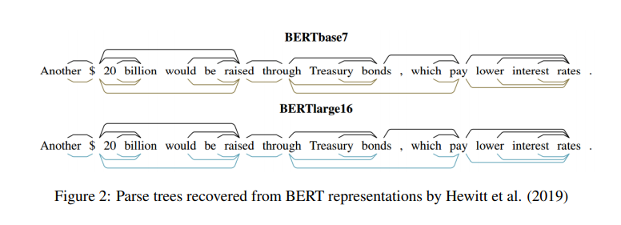

#  A Primer in BERTology: What we know about how BERT works

## Anna Rogers, University of Massachusetts Lowell, 2020

## 1 Abstract

-   Transformer-based models are now widely used in NLP, but we still do not understand a lot about their inner workings. This paper describes what is known to date about the famous BERT model (Devlin et al., 2019), synthesizing over 40 analysis studies. We also provide an overview of the proposed modifications to the model and its training regime. We then outline the directions for further research. 
-   介绍BERT， 分析40个研究成果，提供综述和发展方向

## 2 BERT

-   
-   

## 3 BERT Embedding

-   contextual presentation
-   BERT’s representation space, the term ‘embedding’ refers to the output vector of a given (typically final) Transformer layer. 

## 4 What knowledge does BERT have?

## 4.1 Syntactic knowledge

## 4.2 Semantic Knowledge

## 4.3 World Knowledge

-   

## 5 Localizing linguistic knowledge

## 5.1 self-attention heads

## 5.2 BERT Layers

## 6 Training BERT

## 6.1 Pre-trained BERT

-   Remove NSP
-   Dynamic masking
-   Beyond sentence MLM

## 6.2 Model Architecture choices

## 6.3 Fine-tuning BERT

## 7 How big should BERT be?

## 7.1 Overparametrization

## 7.2 BERT Compression

## 8 Multilingual BERT

## 9 Discussion

## 9.1 Limitation

## 9.2 Direction for further research

## Conclusion

