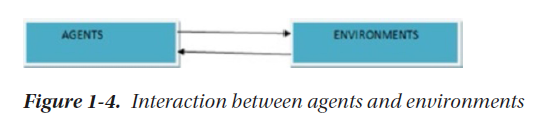
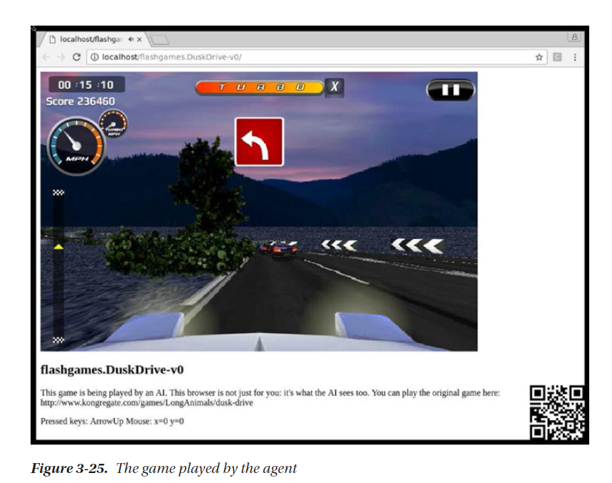
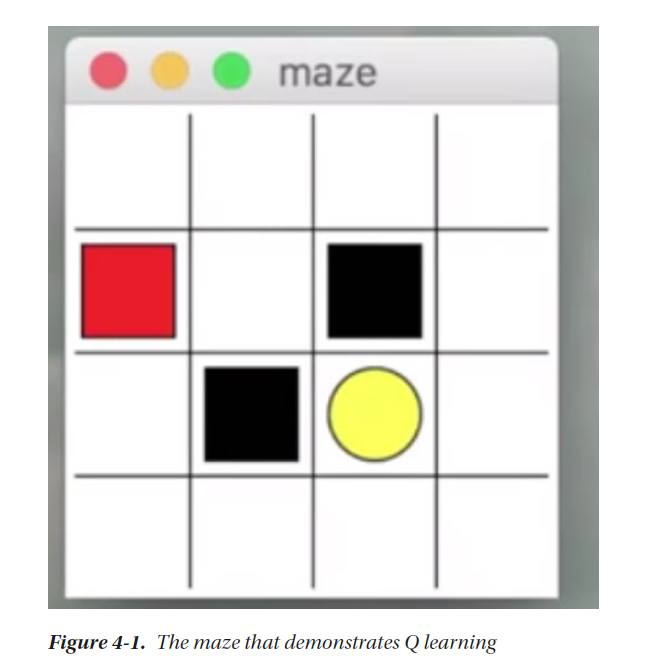

# Reinforcement Learning

[TOC]

# 1  Reinforcement Learning Basic

-   Important points of RL
    -   和ML不同，不看训练集
    -   不是和data交互，而是和environment交互
    -   parameters从environment中来
    -   environment是2d,或者 3d
    -   RL 目标是goal
    -   Rewards从环境中来
-   
-   
-   
-   

## 1.1 Faces of Reinforcement Learning

-   

## 1.2 Flow of RL

## 1.3 Different Terms in RL

-   Gamma

    -   common in RL

-   Lambda

    -   temporal difference problems

    

    

    

    

## 1.4 Rewards如何起作用

​    

    -   Agent
    
    
    
    ## 1.5 Determinstic 确定性
    
    -   DFA 确定状态机
    -   
    -   NDFA
    -   
    -   单Agent
    -   
    -   多Agent
    -   

​    

# 2 RL 理论和算法

    -   MDP: markov decision process (马尔科夫决策过程)
    
    
    
     

-   enviroments	

    -   python
    -   conda
    -   docker
    -   
    -   
    -   
    -   
    -   
    -   
    -   
    -   
    -   
    -   
    -   

## 2.1 SARSA (State Action Reward next State and next Action)

      

## 2.2 什么是Q

-   怎么用Q
-   
-   
-   
-   

## 2.3 动态规划

# 3 OpenAI 基础

## 3.1 安装 OpenAI Gym和 OpenAI Universe

## 3.2 使用OpenAI Gym 

## 3.3 更多模拟

## 3.4 OpenAI Universe

## 3.5 总结

-   OpenAI
-   OpenAI Gym
-   OpenAI Universe

# 4 用Python来进行强化学习

## 4.1 用python 进行QLearning

## 4.2 RL Brain

## 4.3 使用MDP 工具库

## 4.4 理解Swarm Intelligence (SI)

## 4.5 基于Ant的规划

## 4.6 构建 Game AI

## 4.7 总结

-   QLearning
-   MDP toolbox
-   swarm intelligence
-   game AI

# 5 用Keras, TF, ChainerRL进行强化深度学习

## 5.1 Keras

## 5.2 Keras 做RL

-   python
-   keras
-   pygame
-   scikit-image

## 5.3 用Chainer RL

## 5.4 用Keras, TF进行QLearning （Keras-RL)

# 6 Google DeepMind和RL的未来

## 6.1 Google DeepMind

## 6.2 Monte Carlo Search

## 6.3 Human VS Machine

