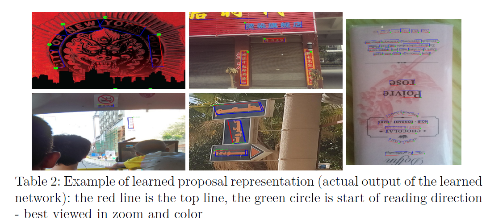

# E2E-MLT - an Unconstrained End-to-End Method for Multi-Language Scene Text
[TOC]

## 0 Michal Bušta, 

https://github.com/MichalBusta/E2E-MLT

### 0.1 Generating Samples with Text in non-Latin (English) Scripts

-   @JarveeLee has modified the pipeline for generating samples with Chinese text [here](https://github.com/JarveeLee/SynthText_Chinese_version).
-   @adavoudi has modified it for arabic/persian script, which flows from right-to-left [here](https://github.com/adavoudi/SynthText).
-   @MichalBusta has adapted it for a number of languages (e.g. Bangla, Arabic, Chinese, Japanese, Korean) [here](https://github.com/MichalBusta/E2E-MLT).
-   @gachiemchiep has adapted for Japanese [here](https://github.com/gachiemchiep/SynthText).
-   @gungui98 has adapted for Vietnamese [here](https://github.com/gungui98/SynthText).
-   @youngkyung has adapted for Korean [here](https://github.com/youngkyung/SynthText_kr).

# 1 Abstract

-   An end-to-end trainable (fully differentiable) method for multilanguage
    scene text localization and recognition is proposed. The approach
    is based on a single fully convolutional network (FCN) with
    shared layers for both tasks.
-   E2E-MLT is the first published multi-language OCR for scene text. While
    trained in multi-language setup, E2E-MLT demonstrates competitive
    performance when compared to other methods trained for English scene
    text alone. The experiments show that obtaining accurate multi-language
    multi-script annotations is a challenging problem
-   特点：
    -   全卷积网络
    -   E2E-MLT和英文效果相当
    -   多语言标注难度较大

# 1 Introduction

With E2E-MLT, we make the following contributions:

-   – We experimentally demonstrate that script identification is not required torecognize multi-language text. Unlike competing methods [12,33], E2E-MLT performs script identification from the OCR output using a simple majority voting mechanism over the predicted characters.
-   E2E-MLT is capable of recognizing highly rotated and vertical text instances,which is achieved by using a cos(x) – sin(x) representation of the angle.
-    We validate that FCN based architecture is capable of handling multi-languagetext detection and recognition.  

- E2E-MLT is the first published multi-languageOCR which works well across six languages.
- We provide the statistics of co-occurring languages at the image level andword level on the ICDAR RRC-MLT 2017 [33] dataset. These statisticsdemonstrate that characters from different languages can not only co-occurin same image, but also co-occur within the same word
- We publicly release a large scale synthetically generated dataset for training multi-language scene text detection, recognition and script identification methods.
- 重点：
    - 从ocr 输出，众数投票
    - 高度旋转和垂直问题，通过cos(x)-sin(x)解决
    - FCN 可以解决多文本检测
    - 第一个多语言ocr, 六语言
    - 共现语言和共现单词没问题
    - 公开数据集和检测方法

# 2 Related Work

## 2.1 Scene Text Localization

## 2.2 Scene Text Recognition

## 2.3 End-to-End Scene Text Methods

# 3 Method

## 3.1 Multi-Language Synthetic Data Generation

-   MLT 2017
    -    6 language, 7200 train, 1800 test
-   Text in the real world usually appears in well-defined regions, which can be
    characterized by uniform color and texture.
    -   This is achieved by thresholding gPb-UCM contour hierarchies [2] using efficient graph-cut implementation [3]. This provides prospective segmented regions for rendering text.
-   Dense estimate of depth maps of segmented regions are then obtained using
    [28] and then planar facets are fitted to maps using RANSAC [9].
    -   This way normals to prospective regions for text rendering is estimated.
-   Finally, the text is aligned to prospective image region for rendering.
    -   This is achieved by warping the image region to frontal-parallel view using the estimated region normals, then a rectangle is fitted to this region, and finally, the text is aligned to the larger side of this rectangle.
-   245000 images

## 3.2 Overall Architecture

## 3.3 Text Localization

## 3.4 Text Recognition

## 3.5 Training Details

# 4 Experiments

## 4.1 Multi-Language Scene Text Recognition

-   The OCR accuracy on cropped words

    

    

    

    

    

    

    

    ## 4.4 Joint Multi-Language Text Localization and Script Identification on the ICDAR RRC-MLT 2017

# 5 Conclusion

