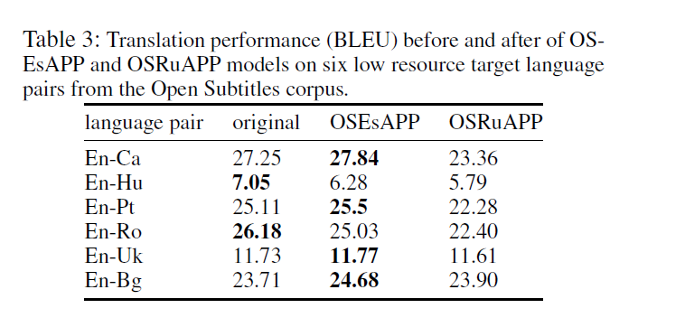
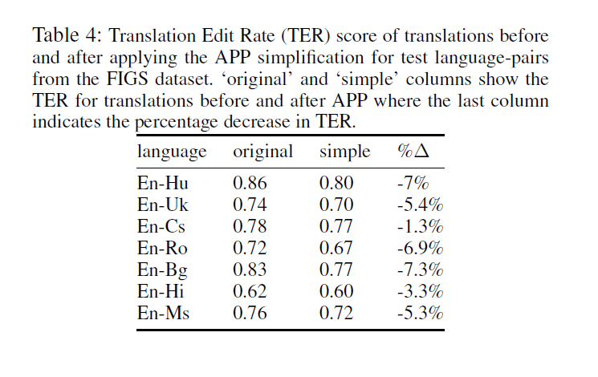

# Simplify-then-Translate: Automatic Preprocessing for Black-Box Translation

-   netflix & Virginia Tech, AAAI 2020

# 0 Abstract

-   Black-box machine translation systems have proven incredibly useful for a variety of applications yet by design are hard to adapt, tune to a specific domain, or build on top of. In this work, we introduce a method to improve such systems via automatic pre-processing (APP) using sentence simplification. We first propose a method to automatically generate a large in-domain paraphrase corpus through back-translation with a black-box MT system, which is used to train a paraphrase model that “simplifies” the original sentence to be more conducive for translation. The model is used to preprocess source sentences of multiple low-resource language pairs. We show that this preprocessing leads to better translation performance as compared to non-preprocessed source sentences.We further perform side-by-side human evaluation to verify that translations of the simplified sentences are better than the original ones. Finally, we provide some guidance on recommended language pairs for generating the simplification model corpora by investigating the relationship between ease of translation of a language pair (as measured by BLEU) and quality of the resulting simplification model from backtranslations of this language pair (as measured by SARI), and tie this into the downstream task of low-resource translation.
-   黑盒NMT很好，但领域适配难 （字幕适配）
-   通过BT设计前处理（automatic pre-processing, APP),简化源语言（越简单的语言，翻译越好）
-   7个语种上，WER下降1.3%-7.3%，英语-保加利亚语，BLEU从10.2提升30+

# 1 原理

-   jump in, 大部分时候翻译为“跳入（jump）”
-   而结合上下文，应该翻译为“掌控（take part in)” 

# 2 APP with Back-Translation

-   
-   英-保加利亚， BLEU　10.2 提升至33.39
    -   

-   两个考虑：
    -   通过回译，可以得到简化的源
    -   训练APP，sequence-to-sequence
-   

# 3 Evaluation

-   
-   
-   In-domain  VS out-of-domain, 前者大幅提升，后者性能下降
-   
-   6个低资源，4个”英西APP“有提升， “英俄APP”没有提升

# 4 Results

-   
-   
-   译后编辑（PE) TER下降了1.3-7.3%
-   
-   人工评估，也是变好
-   
-   
-   高资源语对训练APP更好
-   
-   变好，变坏的case，变坏的主要是代词错误
-   
-   