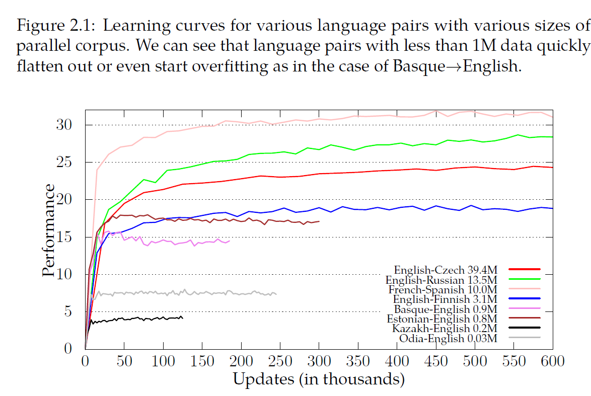

# Transfer Learning in NMT

## 0 Abstract

本文探讨了跨语言迁移学习在神经网络中的应用，以解决资源匮乏的问题。我们提出了几种转移学习方法来重用预先训练在高资源语言对上的模型。我们特别注意技术的简单性。我们研究了两种情形：

-   （a）当我们重用高资源模型而不事先修改其训练过程时；

-   （b）当我们可以预先准备第一阶段的高资源模型用于转移学习时。

    对于前一个场景，我们通过重用其他研究人员训练的模型，提出了一种概念证明方法。在后一种情况下，我们提出了一种在翻译性能上得到更大改进的方法。除了提出的技术外，我们还着重于对迁移学习技术进行深入的分析，并试图对迁移学习的改进有所启发。

## 1 Contribution

-   Transfer learning works for both low and high-resource language pairs and achieves better performance than training from random initialization.
-   高低资源都起作用，比随机初始化好‘
-    Transfer learning in NMT does not have negative effects known in other fields and can be used as an initialization method for NMT experiments.
-   NMT领域中，迁移学习没有别的方法带来的副作用’
-    We show that the quantity of parallel corpus plays a more important role in transfer learning than relatedness of language pairs.
-   平行语料质量，比语言相关性更重要
-    We observe that transfer learning works as a better initialization technique and improves performance even when no language is shared between both models.
-   迁移学习初始化技术，在语言无共享情况下，都起作用

## 2 Low-resource languages and describe language resource categories

### 2.1 Language Resources

  k - for thouands; m - for millions

-   domain in NMT
    -   topic or genre, IT, News, patents
    -   formal vs unformal
    -   sentiment
-   Low resource language
-   
-   Resource Quality
-   Corpus Cleaning

## 3 NMT architecture with word embedding and segmentation

## 4 Transfer Learning in NMT

## 5 Transfer Learning gains and understanding

