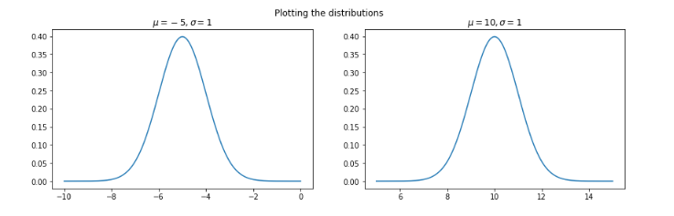
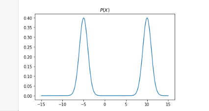
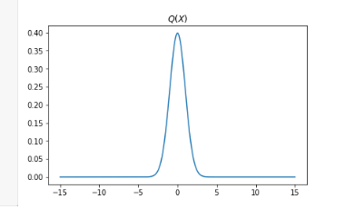
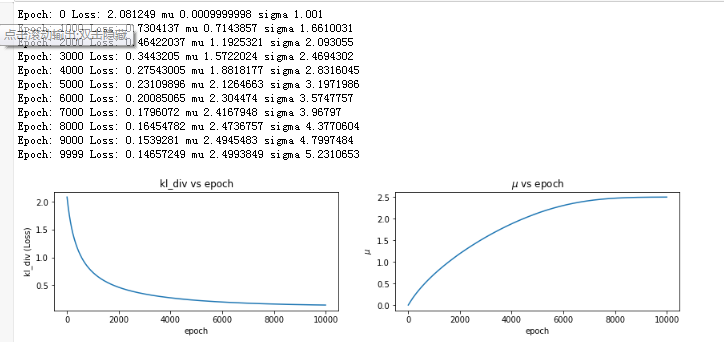
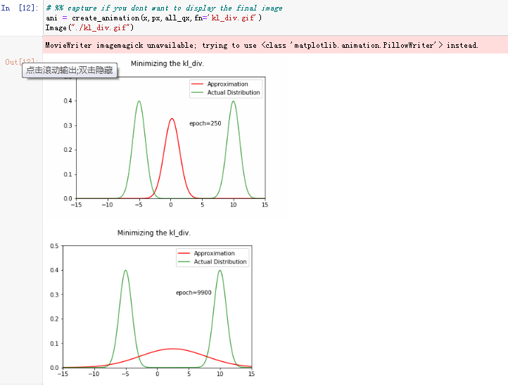
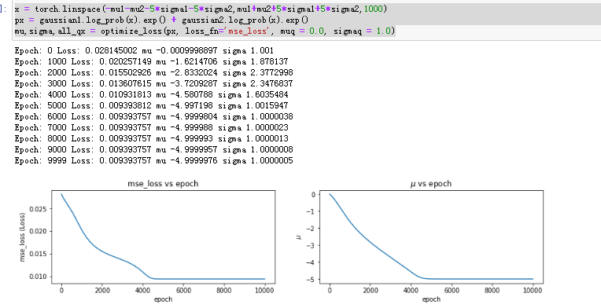
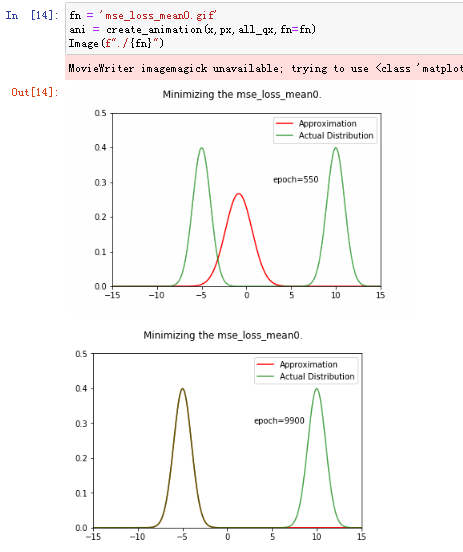
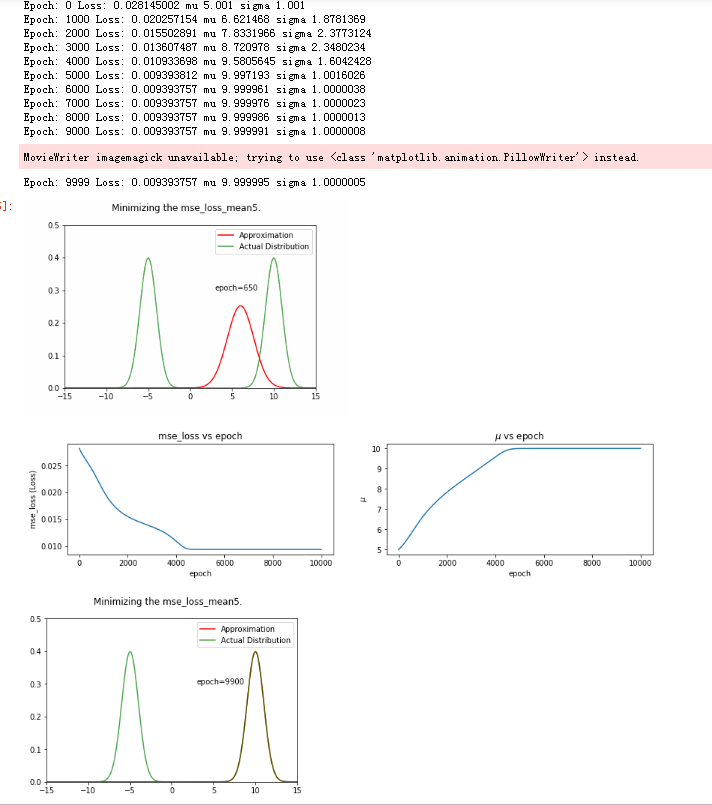
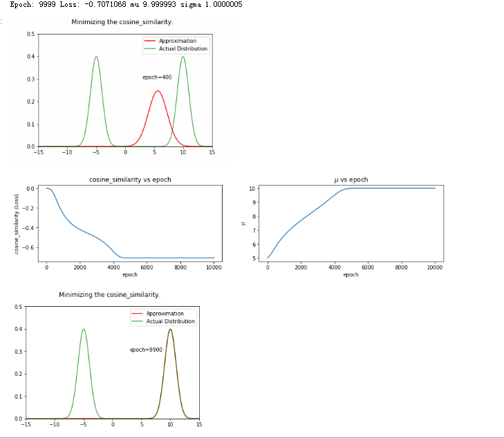

# 理解KL散度 （KL Divergence)

[TOC]

## 1 解决问题： 测量两个分布差异，找到参数，使差异最小（KL测量,相同时KL=0），如果cos测量，差异值最大（相同时cos =1)

-   KL Divergence is a measure of how one probability distribution (P) is different from a second probability distribution (Q).
-    If two distributions are identical, their KL div. should be 0. 
-   Hence, by minimizing KL div., we can find paramters of the second distribution (Q) that approximate P.
-   说人话：
    -   测量两个分布（P)(Q）差距
    -   如果一致，KL 为0 （最小化为目标）
        -    如果用mse量度，最小为目标；
        -   如果用cos量度，最大为目标
    -   找到最合适的参数，使KL最小 
        -   核方法，用线性、高阶或者rbf来拟合问题
            -   找到极值
            -   找到极值所对应的参数

## 2 实验 - 用KL散度，进行两个一维正态分布拟合

## 2.1 源分布（P)，两个正态分布之和

-   ~~~
    mu1,sigma1 = -5,1
    mu2,sigma2 = 10,1
    
    gaussian1 = torch.distributions.Normal(mu1,sigma1) 
    gaussian2 = torch.distributions.Normal(mu2,sigma2)
    ~~~

-   

-   ~~~
    # PX = gaussian1 + gaussian2
    
    x = torch.linspace(-mu1-mu2-5*sigma1-5*sigma2,mu1+mu2+5*sigma1+5*sigma2,1000)
    px = gaussian1.log_prob(x).exp() + gaussian2.log_prob(x).exp()
    ~~~

-   

## 2.2 目标分布（Q)，一个正态分布

-   ~~~
    mu = torch.tensor([0.0])
    sigma = torch.tensor([1.0])
    
    plt.figure(figsize=(14,4))
    x = torch.linspace(-mu1-mu2-5*sigma1-5*sigma2,mu1+mu2+5*sigma1+5*sigma2,1000)
    Q = torch.distributions.Normal(mu,sigma) # this should approximate P, eventually :-)
    qx = Q.log_prob(x).exp()
    plt.subplot(1,2,2)
    plt.plot(x.numpy(),qx.detach().numpy())
    plt.title('$Q(X)$')
    ~~~

-   

 

## 2.3 用KL散度进行P,Q拟合（学习）

-   KL散度

    -   $$𝐷_{𝐾𝐿}(𝑃(𝑥)||𝑄(𝑋))=∑_{𝑥∈𝑋}𝑃(𝑥)log(𝑃(𝑥)/𝑄(𝑥))$$

-   pytorch KL散度代码

    -   https://pytorch.org/docs/stable/nn.html#torch.nn.functional.kl_div

-   代码

    -   ~~~
        px = gaussian1.log_prob(x).exp() + gaussian2.log_prob(x).exp()
        qx = Q.log_prob(x).exp()
        F.kl_div(qx.log(),px)
        ~~~

    -   ~~~
        px = gaussian1.log_prob(x).exp() + gaussian2.log_prob(x).exp()
        qx = Q.log_prob(x)
        F.kl_div(qx,px)
        ---------------
        tensor(2.0812)  # D(P, Q) = 2.08
        ~~~

-   迭代计算（kernel方法)

    -   ~~~
        def optimize_loss(px: torch.tensor, loss_fn: str, muq: float = 0.0, sigmaq: float = 1.0,\
                          subsample_factor:int = 3,mode:str = 'min') -> Tuple[float,float,List[int]]:
            
            mu = torch.tensor([muq],requires_grad=True)
            sigma = torch.tensor([sigmaq],requires_grad=True)    
        
            opt = torch.optim.Adam([mu,sigma])
        
            loss_val = []
            epochs = 10000
        
            #required for animation
            all_qx,all_mu = [],[]
            subsample_factor = 3 #have to subsample to reduce memory usage
        
            torch_loss_fn = getattr(F,loss_fn)
            for i in range(epochs):
                Q = torch.distributions.Normal(mu,sigma) # this should approximate P
                if loss_fn!='kl_div': # we need to exponentiate q(x) for these and few other cases
                    qx = Q.log_prob(x).exp()
                    all_qx.append(qx.detach().numpy()[::subsample_factor])
                else:
                    qx = Q.log_prob(x)
                    all_qx.append(qx.exp().detach().numpy()[::subsample_factor])
                    
                if mode=='min':
                    loss = torch_loss_fn(qx,px)
                else:
                    loss = -torch_loss_fn(qx,px,dim=0)
            #   backward pass
                opt.zero_grad()
                loss.backward()    
                opt.step()
                loss_val.append(loss.detach().numpy())
                all_mu.append(mu.data.numpy()[0])
                
                
                if i%(epochs//10)==0:
                    print('Epoch:',i,'Loss:',loss.data.numpy(),'mu',mu.data.numpy()[0],'sigma',sigma.data.numpy()[0])
        
        
            print('Epoch:',i,'Loss:',loss.data.numpy(),'mu',mu.data.numpy()[0],'sigma',sigma.data.numpy()[0])
            
            plt.figure(figsize=(14,6))
            plt.subplot(2,2,1)
            plt.plot(loss_val)
            plt.xlabel('epoch')
            plt.ylabel(f'{loss_fn} (Loss)')
            plt.title(f'{loss_fn} vs epoch')
            
            plt.subplot(2,2,2)
            plt.plot(all_mu)
            plt.xlabel('epoch')
            plt.ylabel('$\mu$')
            plt.title('$\mu$ vs epoch')
            
            return mu.data.numpy()[0],sigma.data.numpy()[0],all_qx
        ~~~

    -   ~~~
        # 用KL散度做量度，init(mu =0.0, sigma=1.0)
        x = torch.linspace(-mu1-mu2-5*sigma1-5*sigma2,mu1+mu2+5*sigma1+5*sigma2,1000)
        px = gaussian1.log_prob(x).exp() + gaussian2.log_prob(x).exp()
        mu,sigma,all_qx = optimize_loss(px, loss_fn='kl_div', muq = 0.0, sigmaq = 1.0)
        ~~~

    -   迭代10000步，$Loss = 0.14,\ \mu = 2.49,\ \sigma = 5.2$

    -   

    -   动画展示

        -   
        -   ！[kl_div](kl_div.gif)

    ## 2.4 用MSE进行拟合

    -   mse拟合，$\mu=0.0, \sigma=1$, 最终拟合到左边这个高峰

        -   ~~~
            x = torch.linspace(-mu1-mu2-5*sigma1-5*sigma2,mu1+mu2+5*sigma1+5*sigma2,1000)
            px = gaussian1.log_prob(x).exp() + gaussian2.log_prob(x).exp()
            mu,sigma,all_qx = optimize_loss(px, loss_fn='mse_loss', muq = 0.0, sigmaq = 1.0)
            ~~~

        -   

        -   

        -   

    -   mse拟合，$\mu=5.0, \sigma=1.0$,最终拟合到右边这个高峰

        -   ~~~
            x = torch.linspace(-mu1-mu2-5*sigma1-5*sigma2,mu1+mu2+5*sigma1+5*sigma2,1000)
            px = gaussian1.log_prob(x).exp() + gaussian2.log_prob(x).exp()
            mu,sigma,all_qx = optimize_loss(px, loss_fn='mse_loss', muq = 5.0, sigmaq = 1.0)
            
            fn = 'mse_loss_mean5.gif'
            ani = create_animation(x,px,all_qx,fn=fn)
            Image(f"./{fn}")
            ~~~

        -   

## 2.4 cos loss进行拟合

-   ~~~
    x = torch.linspace(-mu1-mu2-5*sigma1-5*sigma2,mu1+mu2+5*sigma1+5*sigma2,1000)
    px = gaussian1.log_prob(x).exp() + gaussian2.log_prob(x).exp()
    mu,sigma,all_qx = optimize_loss(px, loss_fn='cosine_similarity', muq = 5.0, sigmaq = 1.0,mode='max')
    
    fn = 'cosine_similarity.gif'
    ani = create_animation(x,px,all_qx,fn=fn)
    Image(f"./{fn}")
    ~~~

-   

-   最终拟合到右边高峰