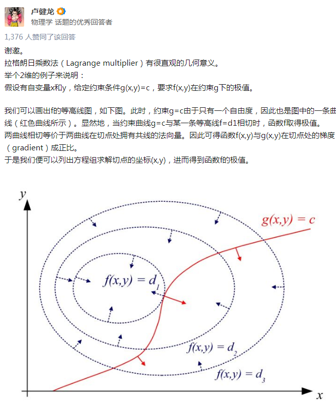
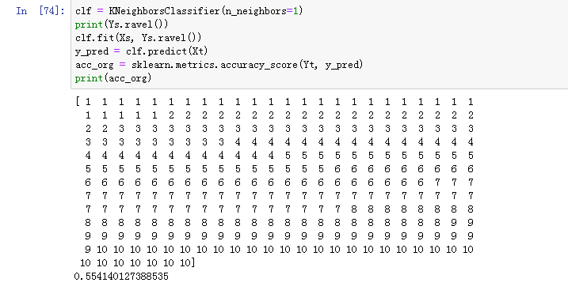
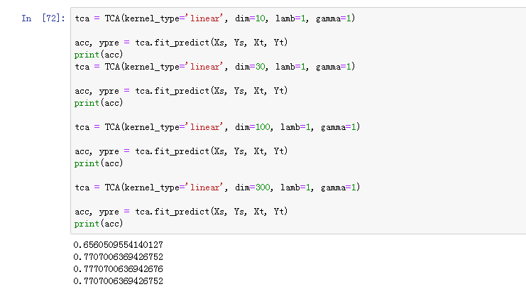
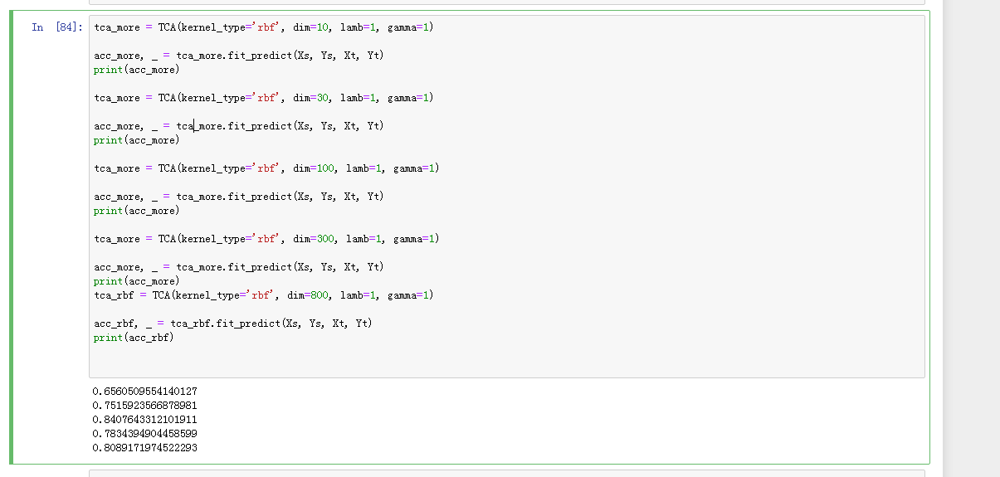

# Domain Adaptation via Transfer Component Analysis

@ Sinno Jialin Pan

[TOC]

## Abstract 

Domain adaptation solves a learning problem in a target domain by utilizing the training data in a different but related source domain. Intuitively, discovering a good feature representation across domains is crucial. In this paper, we propose to find such a representation through a new learning method, transfer component analysis (TCA), for domain adaptation. **TCA tries to learn some transfer components across domains in a Reproducing Kernel Hilbert Space (RKHS) using Maximum Mean Discrepancy (MMD). ** In the subspace spanned by these transfer components, data distributions in different domains are close to each other. As a result, with the new representations in this subspace, we can apply standard machine learning methods to train classifiers or regression models in the source domain for use in the target domain. The main contribution of our work is that we propose a novel feature representation in which to perform domain adaptation via a new parametric kernel using feature extraction methods, which can dramatically minimize the distance between domain distributions by projecting data onto the learned transfer components. Furthermore, our approach can handle large datsets and naturally lead to out-of-sample generalization. The effectiveness and efficiency of our approach in are verified by experiments on two real-world applications: cross-domain indoor WiFi localization and cross-domain text classification.

域自适应通过利用不同但相关的源域中的训练数据来解决目标域中的学习问题。直观地说，发现跨域的良好特征表示是至关重要的。在本文中，我们提出了一种新的学习方法，即转移组件分析（TCA），来寻找这样的表示，以适应领域。**TCA尝试使用最大平均差（MMD）来学习在再生内核Hilbert Space（RKHS）中跨域的一些传输组件**。在这些传输分量所跨越的子空间中，不同域中的数据分布是相互接近的。因此，利用此子空间中的新表示，我们可以应用标准的机器学习方法来训练源域中的分类器或回归模型，以便在目标域中使用。本文的主要贡献在于提出了一种新的特征表示方法，利用特征提取的方法，通过一个新的参数核来进行域自适应，通过将数据投影到学习的传输分量上，可以显著地减小域分布之间的距离。此外，我们的方法可以处理大数据集，并自然导致样本外的泛化。通过两个实际应用：跨域室内WiFi定位和跨域文本分类的实验，验证了该方法的有效性和有效性。

## 1 MMD/MMDE

-   MMD pros:

    -   (1) MMDE is transductive, and does not generalize to out-of-sample patterns;
    -   (2) MMDE learns the latent space by solving a semi-definite program (SDP), which is a very expensive optimization problem

-   问题假设: 

    -   源和目标分布不同，但源和目标的条件分布相同
    -   $$P(X_S) \neq Q(X_T), 即 P\neq Q$$ ，  marginal distribution 不同
    -    $$ P(Y_S|X_S) = P(Y_T|X_T)$$ ， conditional distribution 相同

-   MMD:

    -   **Kullback-Leibler (KL) divergence**, 评估两个分布相似性，但需要知道中间密度估计（However, many of these criteria are parametric, since an intermediate density estimate is usually required.)

    -   **Maximum Mean Discrepancy (MMD) **  Borgwardt et al. [2006] 

    -   $$
        P : X = {x_1, x_2, ..., x_{n1}} \\
        Q ： Y = {y_1, y_2, ..., y_{n2}} \\
        MMD : Dist(X, Y) = ||\frac{1}{n_1}\sum^{n_1}_{i=1}\phi(x_i)-\frac{1}{n_2}\sum^{n_2}_{i=1}\phi(y_i)||_{H}
        $$

    -   H :  **Reproducing Kernel Hilbert Space(RKHS)**

    -   $$\phi: X \rightarrow H$$

-   基于均值差，估算分布差

    -   the distance between distributions of two samples can be well-estimated by the distance between the means of the two samples mapped into a RKHS

    

## 2 TCA

## 2.[1]() 问题分析：

-   前提条件：

    -   已知$X_S, Y_S, X_T$, 不知 $Y_T$
    -   边缘分布$P(X_S), Q(X_T)$很不一样
    -   条件分布，基本一致  $P(Y_S|X_S)=P(Y_T|Y_S)$

-   目标：

    -   找一个同时适合$X_S, X_T$的表示$X^\prime_S, Y^\prime_T$（latent representation)

    $$
    \phi: X \rightarrow H \\
    X^\prime_S= \{x^\prime_{s_i}\} = {\phi(x_{S_i})} \\
    X^\prime_T=\{x^\prime_{T_i}\} = {\phi(x_{T_i})} \\
    X^\prime = X^\prime_S\bigcup X^\prime_T
    $$

    

    -   **$X^\prime_S, X^\prime_T, X^\prime$ **也就分别是输入域，输出域和组合域

-   求解过程：

    -   过程1 ,源分布迁移： **使$P^\prime(X^\prime)=Q^\prime(Y^\prime)$**

        -   **目标函数：**

            -   $$
                TCA: Dist(X^\prime_S, Y^\prime_T) = ||\frac{1}{n_1}\sum^{n_1}_{i=1}\phi(x_{S_i})-\frac{1}{n_2}\sum^{n_2}_{i=1}\phi(x_{T_i})||^2_{H}
                $$

        -   公式1，2的最后一行，前面没有平方，后面有平方，总体来说算距离问题不大

    -   过程2，判定过程维持不变：**转换函数$\phi$满足**

        -   $$
            P \neq Q\\
            P(Y_S|\phi(X_S))=P(Y_T|\phi(X_T))
            $$

            

             

    

## 2.2 核函数学习领域适配（Kernel Learning for Domain Adaptation）

-   Kernel Learning

    -   找非线性变换$\phi$， 变成核函数学习
    -   

    $$
    kernel\ trick: \\
    k(x_i, x_j) =\phi(x_i)^\prime\phi(x_j) \\
    Dist(X^\prime_S,X^\prime_T) = tr(KL) \\
    $$

    -   这里：

        -   

        $$
        K = \begin{bmatrix}K_{S,S} & K_{S,T}\\ K_{T,S} & K_{T,T} \end{bmatrix}
        $$

        -   

        $$
        L =[L_{ij}]\succeq0 = \begin{equation}\begin{cases}
        \frac{1}{n^2_1},\ if x_i,x_j \in X_S \\
        -\frac{1}{n_1n_2},\ if x_i, x_j \in other \\
        \frac{1}{n^2_2}, \ if x_i, x_j \in X_T
        \end{cases}\end{equation}
        $$

        -   **K**: kernel matrix, $(n1+n2)\times(n1+n2)$
        -   **PCA**求解

-   Parameter Kernel Map for unseen pattern

    -   $$
        K = (KK^{-1/2})(K^{-1/2}K) \\
        \tilde{K} = (KK^{-1/2}\tilde{W})(\tilde{W}^TK^{-1/2}K) = KWW^TK
        $$

    -   where:

        -   $$
            \tilde{W} : (n_1 + n_2)\times m \\
            m \ll n_1+n_2
            $$

        -   $$
            W = K^{-1/2}\tilde{W}\in R^{(n_1+n_2)\times m}
            $$

        -   $$
            \tilde{k}(x_i,x_j) = k^T_{x_i}WW^Tk_{x_j} \\
            k_x=[k(x_1, x),...,k(x_{n_1+n_2},x)]^T\in R^(n_1+n_2)
            $$

    -   最终：

        -   $$
            Dist(X^\prime_S,X^\prime_T) = tr((KWW^TK)L)\\ 
            = tr(W^TKLKW)
            $$

            

-   Transfer Components Extraction

    -   $$
        min(tr(W^TKLKW) + \mu\ tr(W^TW)) \\
        s.t. W^TKHKW = I
        $$

    -   where:

        -   $\mu\ tr(W^TW)\ : 正则化项$
        -   $\mu \ : trade-off 参数$
        -   $I\in R^{m\times m} : Identity\ matrix,单位阵$
        -   $H = I_{n_1+n_2} - \frac{1}{n_1+n_2}11^T$  **centering matrix**
            -   https://blog.csdn.net/qingsong1001/article/details/83015126
            -   对称，半正定
            -   幂等、奇异
        -   $11^T : 全1矩阵，(n_1+n_2)*(n_1+n_2) ; 1^T\in R^{n_1+n_2}: 全1列向量$
        -   $ W^TKHKW = I $, 避免$W=0$,即源域和目标域映射到一个点上

    ## 2.3 TCA优化

    -   $$
        min_W tr((W^TKHKW)^\dagger W^T(I+\mu KLK)W) \\
        or\ max_W tr((W^T(I+\mu KLK)W^{-1}W^TKHKW))
        $$

    -   拉格朗日乘法： https://www.zhihu.com/question/38586401/answer/105588901

        -   $$
            min(f(x,y)),\ s.t. g(x,y)=C \\
            \bigtriangledown(f(x,y) + \lambda g(x,y))=0 \\
            $$

            

        -   Lagrangian of  (13)

            -   $$
                $tr(W^T(I + \mu KLK)W) -  tr((W^TKHKW - I)Z) 
                $$

            -   derivative of w.r.t W = 0

            -   $（I+\mu KLK)W = KHKWZ$

            -   $W^T(I+\mu KLK)W = W^TKHKWZ$

            -   $Z = (W^TKHKW)\dagger W^T(I+\mu KLK)W$

            -   带入第16式，得到14式，**$\dagger 伪逆矩阵$**

            -   也得到14式（2）

            -   $$
                max_W((W^T(I+\mu KLK)W)^{-1}W^TKHKW)
                $$

            -   

        -   第17式的求解是kernel Fisher discriminant (KFD), 是下面矩阵的特征值，即所对应的$n_1+n_2-1$个特征向量

            -   $$
                (I+\mu KLK)^{-1}KHK
                $$

                

## 2.4 计算复杂度

-   kernel learning algorithm, SDP
    -   $O((n_1+n_2)^2) \ in \ \tilde{K}$
    -   总体计算复杂度为$O((n_1+n_2)^{6.5})$

-   简单的降维方法
    -   m个特征向量
    -   $O(m(n_1+n_2)^2)$

## 

## 3 代码

~~~
## 三种不同的kernel函数，原始的，线性和rbf
def kernel(ker, X1, X2, gamma):
    K = None
    if not ker or ker == 'primal':
        K = X1
    elif ker == 'linear':
        if X2 is not None:
            K = sklearn.metrics.pairwise.linear_kernel(np.asarray(X1).T, np.asarray(X2).T)
        else:
            K = sklearn.metrics.pairwise.linear_kernel(np.asarray(X1).T)
    elif ker == 'rbf':
        if X2 is not None:
            K = sklearn.metrics.pairwise.rbf_kernel(np.asarray(X1).T, np.asarray(X2).T, gamma)
        else:
            K = sklearn.metrics.pairwise.rbf_kernel(np.asarray(X1).T, None, gamma)
    return K
    
def fit(self, Xs, Xt):
        '''
        Transform Xs and Xt
        :param Xs: ns * n_feature, source feature
        :param Xt: nt * n_feature, target feature
        :return: Xs_new and Xt_new after TCA
        '''
        X = np.hstack((Xs.T, Xt.T))  ## 转置 Xs,Xt, 堆叠 （dim, n1+n2)
        X = X / np.linalg.norm(X, axis=0) ## 归一化
        m, n = X.shape   ## m = dim, n = n1+n2
        ns, nt = len(Xs), len(Xt)  ## number of source, number of target
        e = np.vstack((1 / ns * np.ones((ns, 1)), -1 / nt * np.ones((nt, 1))))  ## 一维列向量 (n1+n2, 1)
        M = e * e.T ## 对称矩阵 （n1+n2, n1+n2) 对应 公式7
        M = M / np.linalg.norm(M, 'fro') ## L 矩阵
        H = np.eye(n) - 1 / n * np.ones((n, n))  ## H 矩阵
        K = kernel(self.kernel_type, X, None, gamma=self.gamma) ## \phi
        n_eye = m if self.kernel_type == 'primal' else n
        a, b = np.linalg.multi_dot([K, M, K.T]) + self.lamb * np.eye(n_eye), np.linalg.multi_dot([K, H, K.T])  ## a: KLK^T+uI, b:KHK^T 
        w, V = scipy.linalg.eig(a, b) ## w： 特征值， v： 特征向量，而且eig(a,b)=eig(b,a)
        ind = np.argsort(w) ## top k 特征值
        A = V[:, ind[:self.dim]]  ## top k 特征向量
        Z = np.dot(A.T, K)  ## Xs, Xt 转换到 组合域
        Z /= np.linalg.norm(Z, axis=0)  ## 归一化
        Xs_new, Xt_new = Z[:, :ns].T, Z[:, ns:].T   ## 转置回来
        return Xs_new, Xt_new  ## 特征
~~~

## 4 实验

-   数据， 800维向量
-   不迁移 **ACC=0.55**
-   迁移
    -   线性  
        -   10维， **ACC=0.65**
        -   30维，**ACC=0.77**
        -   ==**100维，ACC=0.777**==
        -   300维，**ACC= 0.77**
        -   800维，**ACC=0.77**
    -   rbf kernel 
        -   10维， ACC = 0.65
        -   30维，ACC=0.75
        -   **==100维， ACC = 0.84==**
        -   300维，ACC = 0.78
        -   800维，ACC = 0.80

