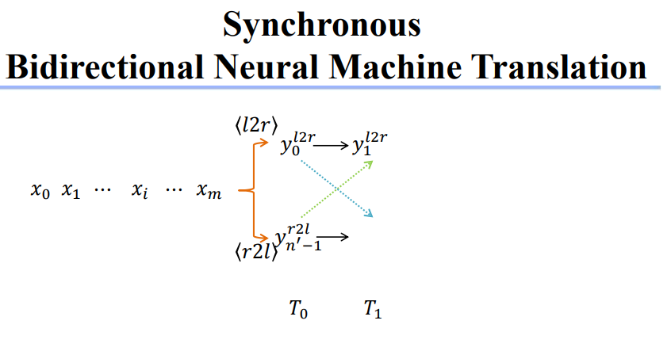
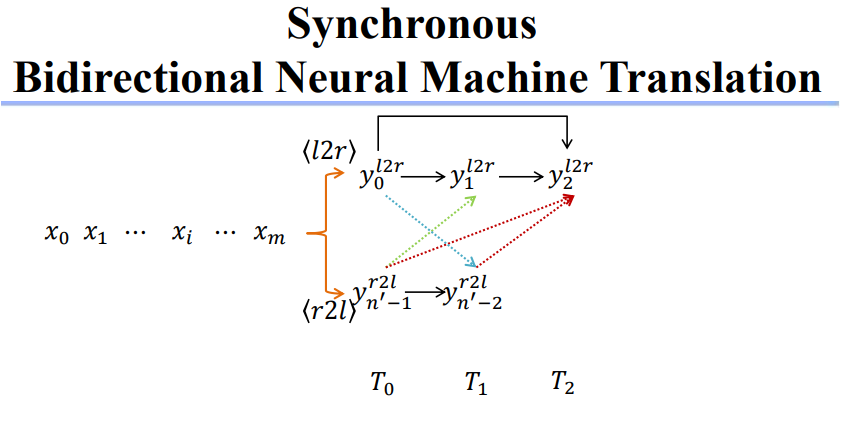
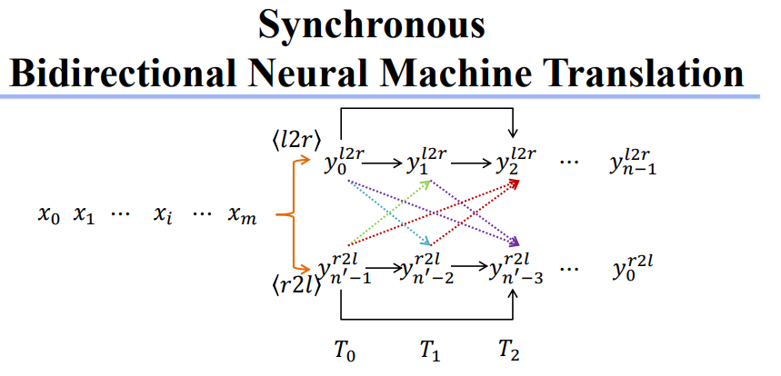
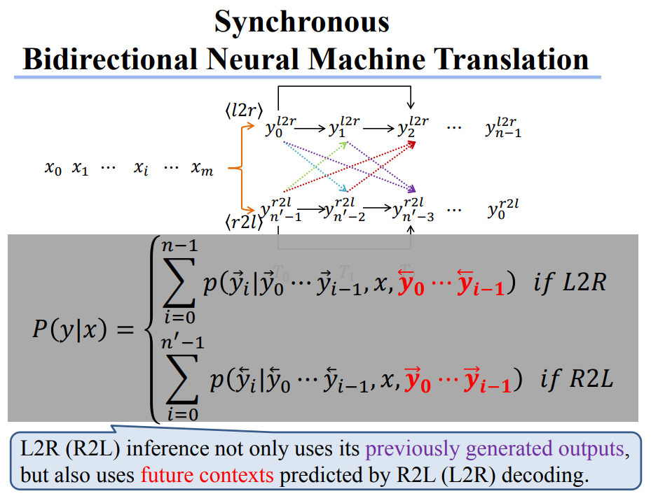
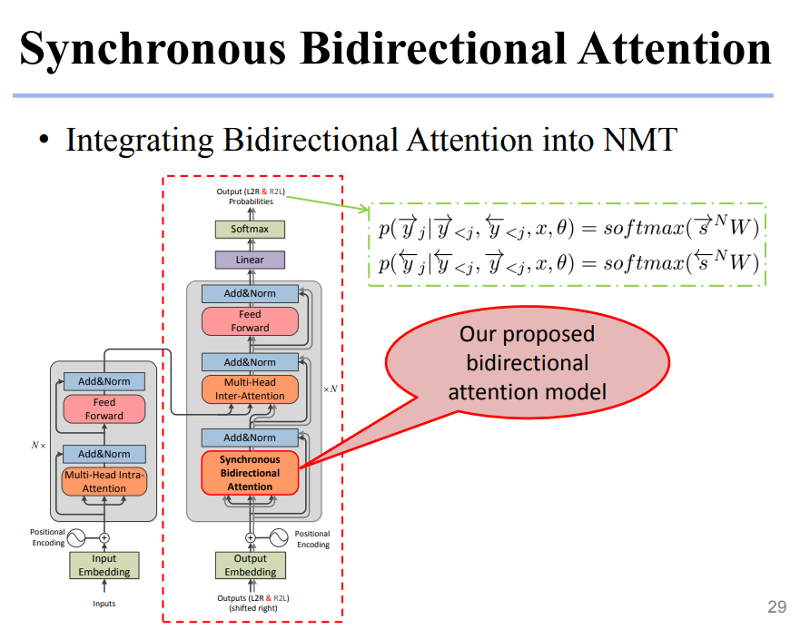

# Text_Generation_From_the_Perspective_of_Interactive_Inference

[jjzhang@nlpr.ia.ac.cn](mailto:jjzhang@nlpr.ia.ac.cn)

https://github.com/ZNLP/sb-nmt

[TOC]

# Synchronous Bidirectional Inference Model (SB-IM, SB-NMT)

# SBIM bidirectional decoding, good results

# SBIM from both side to middle, good efficiency

# SBIM, generate two language, synchronously and interactively

